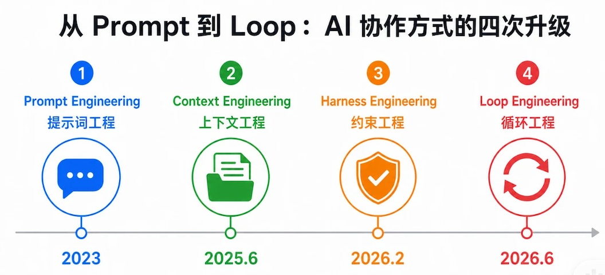

# Coding Agent 核心架构与主流厂商方案对比

> **参考文章**:
> - Sebastian Raschka: [Components of a Coding Agent](https://magazine.sebastianraschka.com/p/components-of-a-coding-agent)
> - Sebastian Raschka: [Using Local Coding Agents](https://magazine.sebastianraschka.com/p/using-local-coding-agents)

---

## 🧩 1. Coding Agent 架构组件演进

Coding Agent 从早期的单轮自动补全演进为今日包含**沙箱环境、多步规划、工具调用、状态管理与反馈自愈**的完整 Harness 系统。

---

## 🏢 2. 主流工业界方案对比

### 方案 A：OpenAI Harness 方案

- **核心机制**：去中心化 Handoff 机制，Subagent A 直接移交给 Subagent B。
- **协议支撑**：依赖专用的 Agents SDK 协议进行通信与控制流转移。

---

### 方案 B：Anthropic Harness 方案
- **三智能体分工**：`Planner (规划)` ──► `Generator (生成)` ──► `Evaluator (评估)`
- **核心特色**：**Dynamic Workflows** 机制，现场由主 Agent 动态生成用过即弃的 JavaScript 编排脚本。
- **状态交接**：基于物理工件（Plan.md、Git 提交记录、测试门控）进行物理状态的显式交接。
- **详见笔记**: [[anthropic_dynamic_workflows|Anthropic Dynamic Workflows 深度解析]]
