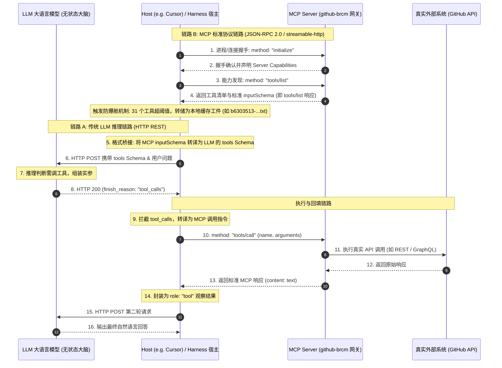
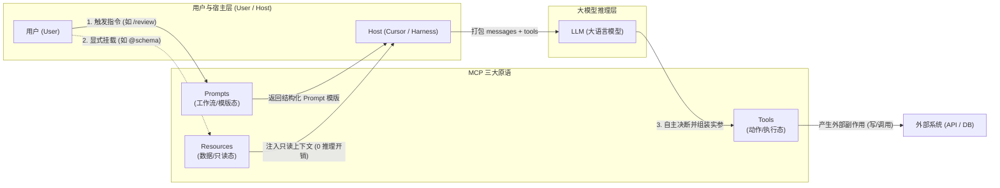
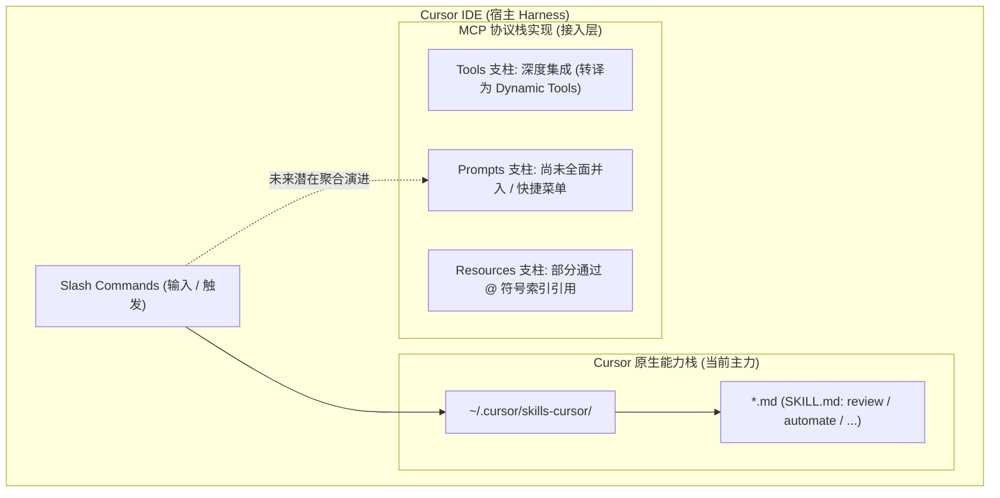
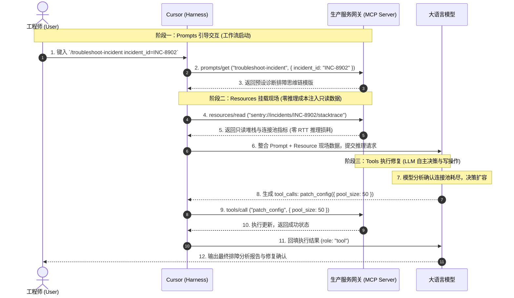

# MCP (Model Context Protocol) 架构定位、底层通信与工程落地深度解析

> **核心工程心智模型**:  
> **LLM 本身对 MCP 一无所知，也不跑 MCP 协议。**  
> MCP 是 AI 宿主（Host (e.g. Cursor) / Harness）与外部工具/数据源之间的**跨进程、跨语言标准化外设总线**（类似开发语言的 LSP，或 AI 时代的 USB-C 接口）。  
> 两段通信完全解耦：**Host (e.g. Cursor) 与 LLM 走标准模型推理 API（HTTP POST + tools Schema），Host (e.g. Cursor) 与 MCP Server 走统一的 JSON-RPC 2.0 协议（stdio / HTTP SSE）。**

---

## 🗺️ 一、 架构真相：MCP 到底处于哪一层？

在许多概念科普中，常将 MCP 与 LLM 工具调用（Tool Calling）混为一谈，甚至误认为“把 MCP 装进了大模型”。**这在架构认知上是错误的。**

### 1. 为什么需要 MCP？（解决 $M \times N$ 生态灾难）

- **传统模式（$M \times N$ 绑定）**：  
如果 Cursor、Claude Desktop、Zed、以及各类私有 Agent 框架要接入 GitHub、Jira、Confluence 等工具，每一个客户端都要为每个工具各自编写专有的集成与适配逻辑。
- **MCP 模式（$M + N$ 标准化）**：  
工具提供方仅需编写一次 **MCP Server**（可以用 Python、TypeScript、Go、Rust 实现）。任何支持 MCP 协议的宿主环境（Host (e.g. Cursor) / Harness）都能即插即用，零成本完成对接。


### 2. 双链路解耦时序图（以企业级 `github-brcm` MCP 为例）




---


## 🔌 二、 真实案例：`github-brcm` 运行时的 4 阶段通信报文还原

在实际生产环境（以当前环境配置的 `github-brcm` MCP Server 为例），其配置于 `~/.cursor/mcp.json`：

```json
{
  "mcpServers": {
    "github-brcm": {
      "type": "streamable-http",
      "url": "https://gateway-github-vcf.apps-tpcf-epic-gto.lvn.broadcom.net/github/mcp"
    }
  }
}
```

底层通信严格遵循 **JSON-RPC 2.0** 报文规范，通信全链路如下：

### 阶段 1：建立连接与握手初始化（Host (e.g. Cursor) ──► MCP Server）

Host (e.g. Cursor) 与远程网关建立 HTTP 长连接后，发起握手：

```json
{
  "jsonrpc": "2.0",
  "id": 1,
  "method": "initialize",
  "params": {
    "protocolVersion": "2024-11-05",
    "capabilities": {
      "roots": { "listChanged": true },
      "sampling": {}
    },
    "clientInfo": {
      "name": "Cursor-Harness",
      "version": "1.0.0"
    }
  }
}
```

`github-brcm` 网关返回服务信息与能力声明：

```json
{
  "jsonrpc": "2.0",
  "id": 1,
  "result": {
    "protocolVersion": "2024-11-05",
    "capabilities": {
      "tools": { "listChanged": true },
      "resources": { "subscribe": true }
    },
    "serverInfo": {
      "name": "github-brcm-gateway",
      "version": "1.2.0"
    }
  }
}
```

随后 Host (e.g. Cursor) 发送确认通知（Notification，无 id）：

```json
{
  "jsonrpc": "2.0",
  "method": "notifications/initialized"
}
```

---


### 阶段 2：工具发现与 `tools/list` 响应（能力清单）

Host (e.g. Cursor) 发送标准能力查询：

```json
{
  "jsonrpc": "2.0",
  "id": 2,
  "method": "tools/list",
  "params": {}
}
```

`github-brcm` 网关返回全部 31 个工具的完整清单。每个工具严格使用 `inputSchema`（JSON Schema 规范）定义入参：

```json
{
  "jsonrpc": "2.0",
  "id": 2,
  "result": {
    "tools": [
      {
        "name": "create_pull_request",
        "description": "Create a new pull request in a GitHub repository",
        "inputSchema": {
          "type": "object",
          "properties": {
            "owner": { "type": "string", "description": "Repository owner" },
            "repo": { "type": "string", "description": "Repository name" },
            "title": { "type": "string", "description": "Pull request title" },
            "head": { "type": "string", "description": "Branch where changes are" },
            "base": { "type": "string", "description": "Branch to pull into" },
            "body": { "type": "string", "description": "Pull request description" }
          },
          "required": ["owner", "repo", "title", "head", "base"]
        }
      },
      {
        "name": "add_comment_to_pending_review",
        "description": "Add review comment to the requester's latest pending pull request review...",
        "inputSchema": {
          "type": "object",
          "properties": {
            "owner": { "type": "string", "description": "Repository owner" },
            "repo": { "type": "string", "description": "Repository name" },
            "pullNumber": { "type": "number", "description": "Pull request number" },
            "path": { "type": "string", "description": "The relative path to the file" },
            "line": { "type": "number", "description": "The line of the blob in the diff" },
            "side": { "type": "string", "enum": ["LEFT", "RIGHT"] },
            "body": { "type": "string", "description": "The text of the review comment" }
          },
          "required": ["owner", "repo", "pullNumber", "path", "body"]
        }
      }
      // ... 共 31 个工具
    ]
  }
}
```

> 📌 **实体工件映射（Artifact Grounding）**：  
> 该步骤中网关回传的 31 个工具 JSON 报文体积达 **36.7 KB，1207 行**。Host (e.g. Cursor) 的 Harness 拦截后触发大文本防爆舱机制，将其转储在项目专属工件中：  
> `~/.cursor/projects/.../agent-tools/b6303513-1540-4aab-8348-e8f5e5b7193b.txt`  
> 该文件中的 `tools` 列表正是此处的 `tools/list` 返回结果。

---


### 阶段 3：格式桥接（Host (e.g. Cursor) 将 MCP `inputSchema` 转为 LLM `parameters`）

LLM 并不认识 MCP 的 `inputSchema`。Host (e.g. Cursor) 将其转译为 OpenAI / Anthropic 规范的标准 `tools` Schema：

```json
{
  "model": "gpt-4o",
  "messages": [
    {
      "role": "user",
      "content": "帮我在 vcf/dl-vm-test-automation 仓库中提一个 PR，将 topic/fix 分支合入 main"
    }
  ],
  "tools": [
    {
      "type": "function",
      "function": {
        "name": "create_pull_request",
        "description": "Create a new pull request in a GitHub repository",
        "parameters": {
          "type": "object",
          "properties": {
            "owner": { "type": "string", "description": "Repository owner" },
            "repo": { "type": "string", "description": "Repository name" },
            "title": { "type": "string", "description": "Pull request title" },
            "head": { "type": "string", "description": "Branch where changes are" },
            "base": { "type": "string", "description": "Branch to pull into" },
            "body": { "type": "string", "description": "Pull request description" }
          },
          "required": ["owner", "repo", "title", "head", "base"]
        }
      }
    }
  ]
}
```

---


### 阶段 4：意图转译与真正执行（Host (e.g. Cursor) ──► `github-brcm` 网关）

LLM 生成决断，返回 `tool_calls`：

```json
{
  "role": "assistant",
  "content": null,
  "tool_calls": [
    {
      "id": "call_pr_001",
      "type": "function",
      "function": {
        "name": "create_pull_request",
        "arguments": "{\"owner\":\"vcf\",\"repo\":\"dl-vm-test-automation\",\"title\":\"fix: resolve test flakiness\",\"head\":\"topic/fix\",\"base\":\"main\"}"
      }
    }
  ]
}
```

Host (e.g. Cursor) 拦截到该响应，从 arguments 反序列化出入参，向 `github-brcm` MCP 网关发送一条标准的 JSON-RPC `tools/call` 请求：

```json
{
  "jsonrpc": "2.0",
  "id": 3,
  "method": "tools/call",
  "params": {
    "name": "create_pull_request",
    "arguments": {
      "owner": "vcf",
      "repo": "dl-vm-test-automation",
      "title": "fix: resolve test flakiness",
      "head": "topic/fix",
      "base": "main"
    }
  }
}
```

`github-brcm` 网关执行完成并返回标准响应：

```json
{
  "jsonrpc": "2.0",
  "id": 3,
  "result": {
    "content": [
      {
        "type": "text",
        "text": "Pull request #88 created successfully: https://github-vcf.devops.broadcom.net/vcf/dl-vm-test-automation/pull/88"
      }
    ],
    "isError": false
  }
}
```

Host (e.g. Cursor) 取出 `content[0].text`，装配成 `role: "tool"` 发送给 LLM 生成人类可读的最终答复：

```json
{
  "role": "tool",
  "tool_call_id": "call_pr_001",
  "content": "Pull request #88 created successfully: https://github-vcf.devops.broadcom.net/vcf/dl-vm-test-automation/pull/88"
}
```

---


## 🏛️ 三、 MCP 的三大支柱（Beyond Tools）

初接触 MCP 时，许多开发者容易产生一种认知偏差：“以为 MCP 只是对 OpenAI Function Calling / Tools 的跨进程标准化封装”。**这种理解大大低估了 MCP 的设计野心。**

MCP 的全称是 **Model Context Protocol（模型上下文协议）** 而非仅仅“工具协议”。其核心使命是**统一 AI 宿主（Host）与外部异构系统之间“上下文注入、工作流引导与动作执行”的完整契约**，由三大核心原语构成：



### 1. 三大原语设计哲学与能力矩阵

| 维度 | **Resources (只读数据源)** | **Prompts (工作流模版)** | **Tools (动作执行)** |
| :--- | :--- | :--- | :--- |
| **驱动主体** | **User / Host 驱动**（显式挂载或被动加载） | **User 驱动**（如输入 `/` 斜杠指令选择模版） | **LLM 决策驱动**（模型推理自发决定） |
| **副作用 (Side-effect)** | **绝对无副作用**（只读、幂等） | **无副作用**（纯文本/消息元数据生成） | **通常有副作用**（写、改、删、外部系统调用） |
| **LLM 推理成本** | **0 次推理**（确定性命中，直接注入上下文） | **0 次决策推理**（用户明确触发，直接拉取） | **1+ 次模型决断**（消耗思考 Token 选工具并组装参数） |
| **网络语义类比** | 相当于 HTTP 的 **GET**（URI 资源定位） | 相当于 **Slash Commands** 或预置表单模版 | 相当于 HTTP 的 **POST / PUT / DELETE** |

---

### 2. 支柱一：Resources（只读数据源与上下文挂载）

#### ① Resources 核心定位与心智模型

> **“让所有外部异构数据，都拥有类似 URI 的统一定址能力，并能像本地文件一样安全、零推理损耗地挂入上下文。”**

- **为什么不全用 Tools 来读取数据？**  
  若把读取数据库 Schema 或日志做成 Tool（如 `get_schema()`）：
  1. **Token 浪费与延迟骤增**：LLM 必须先走一轮推理，输出 `tool_calls: { name: "get_schema" }`，Host 执行后再把结果塞回模型，额外浪费一次往返延迟（RTT）与输入/输出 Token；
  2. **幻觉与误调风险**：LLM 可能漏调、调错入参，或在不该调的时候反复拉取；
  3. **无法满足用户即时精准控制**：当用户在 IDE 键入 `@` 符号希望引用某个外部数据源时，期望的是**确定性、即时的只读上下文挂载**。
- **协议特质**：
  - **URI 统一寻址**：如 `postgres://prod-db/public/schema`、`git://repo/diff`、`file:///var/log/syslog`。
  - **多类型与二进制支持**：原生支持 `text/plain`、`application/json`，以及二进制 `blob`（Base64 编码，如图片、音频、PDF）。
  - **推送订阅机制（Subscription）**：长连接下支持客户端主动订阅，服务端内容变动时推送通知。

#### ② Resources 底层协议报文详解（JSON-RPC 2.0）

- **资源发现（`resources/list` 与 URI 模版 `resources/templates/list`）**：

  ```json
  // 请求
  { "jsonrpc": "2.0", "id": 10, "method": "resources/list" }

  // 响应
  {
    "jsonrpc": "2.0",
    "id": 10,
    "result": {
      "resources": [
        {
          "uri": "postgres://prod-db/public/schema",
          "name": "Production Database Public Schema",
          "description": "PostgreSQL 生产库 public 命名空间的完整 DDL 定义",
          "mimeType": "application/sql"
        }
      ]
    }
  }
  ```

  对于动态路径（如按表名查询），服务端可实现 `resources/templates/list` 暴露 RFC 6570 模版：`postgres://prod-db/{schema}/{table}/ddl`。

- **资源读取（`resources/read`）**：

  ```json
  // 请求
  {
    "jsonrpc": "2.0",
    "id": 11,
    "method": "resources/read",
    "params": { "uri": "postgres://prod-db/public/schema" }
  }

  // 响应 (返回纯文本或二进制 blob)
  {
    "jsonrpc": "2.0",
    "id": 11,
    "result": {
      "contents": [
        {
          "uri": "postgres://prod-db/public/schema",
          "mimeType": "application/sql",
          "text": "CREATE TABLE users (\n  id SERIAL PRIMARY KEY,\n  email VARCHAR(255) NOT NULL UNIQUE\n);"
        }
      ]
    }
  }
  ```

- **实时状态推送（`resources/subscribe` & `notifications/resources/updated`）**：
  这是 Resources 超越传统 Tool 调用的一大杀手锏特性：

  ```mermaid
  sequenceDiagram
      autonumber
      participant Host as Host (Cursor)
      participant MCP as MCP Server (如 Log/Git 监控)

      Host->>MCP: 1. resources/subscribe { uri: "file:///var/log/app.log" }
      MCP-->>Host: 2. 确认订阅成功
      Note over MCP: 监测到底层产生致命错误日志
      MCP--)Host: 3. JSON-RPC 通知: notifications/resources/updated { uri: "..." }
      Host->>MCP: 4. 按需重新拉取: resources/read { uri: "..." }
      MCP-->>Host: 5. 返回最新内容
  ```

  Host 无需死循环轮询工具，只要收到通知即可局部刷新上下文缓存。

#### ③ 宿主落地与真实网关映射：Cursor 的 `@` 上下文机制

在理解 Resources 时，很多开发者容易困惑：“它在 IDE 界面上对应什么？”

- **交互对齐**：如果说 Prompts 映射到 IDE 交互中的 **`/` 斜杠指令（Slash Commands）**，那么 **Resources 在宿主中直接映射为 `@` 上下文引用（Context Mentions）**！
- **Cursor 的现状**：当你在 Cursor 聊天框输入 `@` 时，弹出的 `@Files`、`@Folders`、`@Docs`、`@Git Diff`，本质上就是 Cursor 对本地操作系统与版本控制系统的**只读 Resource 抽象**。

##### 真实环境探查：以当前连接的 3 个生产网关推演 Resources 落地

目前你的 `~/.cursor/mcp.json` 连接了 `vmw-confluence-brcm`、`vmw-jira`、`github-brcm`。这三者目前均只实现了 `tools: {}`，但它们的核心数据**天然是只读 Resource**：

1. **`vmw-confluence-brcm`（企业知识库：最典型的只读 Resource）**：
   - **当前 Tool 模式**：网关暴露了 `get_page(page_id)`、`get_page_by_space_and_title(space, title)`。LLM 必须先消耗一轮推理生成参数调工具，拿回结果再推理下一轮；
   - **若实现 Resource 规范**：网关提供 `confluence://spaces/{spaceKey}/pages/{title}` 模版。你在 Cursor 键入 `@confluence/vcf/architecture`，Harness 直接发起 `resources/read` 将文档瞬间注入会话，**零 RTT 延迟、零思考 Token 浪费**。
2. **`vmw-jira`（工单现场上下文挂载）**：
   - **当前 Tool 模式**：暴露 `jira_get_issue(issue_key)` 工具，由大模型自发决定调或不调；
   - **若实现 Resource 规范**：网关暴露 `jira://issue/{issueKey}`。排障时用户直接输入 `@jira/VCF-8902`，工单的复现步骤、影响范围与关联环境直接被动挂载，杜绝模型选错工具或漏调。
3. **`github-brcm`（远端仓库代码与变更只读挂载）**：
   - **当前 Tool 模式**：暴露 `get_file_contents(owner, repo, path, ref)` 工具；
   - **若实现 Resource 规范**：网关暴露 `github://{owner}/{repo}/{ref}/{path}`，用户可像引用本地文件 `@main.py` 一样直接 `@github/...` 引用远端任意分支的代码。

##### 架构对比：Tool 模式读取 vs Resource 模式挂载

| 评估维度 | **Tool 模式读取（如调用 `get_page`）** | **Resource 模式挂载（如 `@confluence://...`）** |
| :--- | :--- | :--- |
| **触发决策者** | **LLM 推理决定**（模型思考后发起） | **User 显式挂载 / Host 规则预挂载** |
| **网络往返 (RTT)** | **至少 2 次模型往返**（Model $\rightarrow$ tool_call $\rightarrow$ Host $\rightarrow$ MCP $\rightarrow$ tool_result $\rightarrow$ Model） | **仅 1 次模型推理**（Host 预加载 Resource 直接喂给 Model） |
| **推理 Token 开销** | **高**（消耗工具描述 Schema + 模型思考步骤 + 参数拼装 Token） | **极低**（0 思考与参数拼装 Token，仅计入内容本身） |
| **确定性与准确率** | **存在幻觉风险**（模型可能漏调、调错函数、参数格式写错） | **100% 确定性命中**（精确直达，无推理误差） |
| **状态感知能力** | 无感知（只能由模型轮询重调） | **支持长连接推送**（Server 主动通知最新变更） |

---

### 3. 支柱二：Prompts（工作流模版与领域提示词治理）

#### ① Prompts 核心定位与心智模型

> **“将特定领域系统的‘最佳实践提示词（Prompt Engineering）’与复杂审查工作流沉淀在 Server 侧，实现 Prompt as Code 的中心化治理。”**

- **为什么需要服务端 Prompts？**  
  在传统研发模式下，如果团队要推行一套严格的 Git 代码审查或 Bug 提交规范：
  - 管理员只能写一份 Markdown 文档，要求全公司数千名工程师各自在本地 IDE 维护一套规则文件；
  - 规则一旦升级，分散在各个客户端的本地配置无法即时同步。
  - **引入 MCP Prompts 后的架构变化**：由代码托管网关（或质量网关）直接暴露标准 Prompt 模版。任何支持 MCP 的宿主（Cursor、Claude Desktop、Zed 等）只要输入指令，即可拉取到全公司统一认证的最新规范。
- **协议特质**：
  - **强类型参数化（Arguments）**：支持入参校验（如必填项、类型、描述）。
  - **结构化上下文组装**：返回标准 `messages` 序列（支持 `user`、`assistant` 角色预设），并可以直接**内嵌 Resources 资源**。

#### ② Prompts 底层协议报文详解（JSON-RPC 2.0）

- **模版发现（`prompts/list`）**：

  ```json
  // 请求
  { "jsonrpc": "2.0", "id": 20, "method": "prompts/list" }

  // 响应
  {
    "jsonrpc": "2.0",
    "id": 20,
    "result": {
      "prompts": [
        {
          "name": "generate_commit_message",
          "description": "基于当前的 git diff 生成符合 Angular 规范的 commit message",
          "arguments": [
            { "name": "style", "description": "提交风格，例如 conventional 或 gitmoji", "required": false }
          ]
        }
      ]
    }
  }
  ```

- **模版编译与获取（`prompts/get`，高级内联 Resource 用法）**：

  ```json
  // 请求
  {
    "jsonrpc": "2.0",
    "id": 21,
    "method": "prompts/get",
    "params": {
      "name": "generate_commit_message",
      "arguments": { "style": "conventional" }
    }
  }

  // 响应：注意其内联了 type: "resource" 数据
  {
    "jsonrpc": "2.0",
    "id": 21,
    "result": {
      "description": "Generate commit message for staging changes",
      "messages": [
        {
          "role": "user",
          "content": {
            "type": "text",
            "text": "请根据下方提供的 Git 暂存区改动，生成一条严谨的 Commit 信息。规范遵循 conventional 格式。"
          }
        },
        {
          "role": "user",
          "content": {
            "type": "resource",
            "resource": {
              "uri": "git://staging/diff",
              "mimeType": "text/x-diff",
              "text": "--- a/src/auth.ts\n+++ b/src/auth.ts\n@@ -10,2 +10,3 @@\n+ export const verifyToken = () => true;"
            }
          }
        }
      ]
    }
  }
  ```

---

### 4. 关键架构辨析：MCP 协议规范 vs IDE 宿主工程落地

在实际开发使用时，经常会遇到一个困惑：**“既然 MCP 官方定义了 Prompts 支柱，为什么我在 Cursor 里输入 `/` 斜杠指令，弹出的却是 `.cursor/skills-cursor/` 下的 `SKILL.md`？”**

这里揭示了 **“Anthropic MCP 协议规范（Spec）”** 与 **“特定 IDE 宿主工程落地（Harness Implementation）”** 之间的层级差异：



#### ① 对比矩阵：MCP Prompts vs Cursor Skills

| 维度 | **MCP Prompts（协议级原语）** | **Cursor Skills（IDE 平台级实现）** |
| :--- | :--- | :--- |
| **定义归属** | **MCP 官方协议规范标准**（跨客户端通用） | **Cursor 自研的产品功能**（Cursor 私有规范） |
| **存储介质** | **远程/本地 MCP Server 内存与后端代码中** | **开发者本地磁盘文件**（`~/.cursor/skills-cursor/*/SKILL.md`） |
| **通信链路** | 标准 **JSON-RPC 2.0** (`prompts/list`, `prompts/get`) | **本地文件系统直读**（IDE 文件 IO 加载） |
| **更新与治理** | **服务端集中更新**：企业网关更新一次，全员秒级无感生效 | **客户端本地分散更新**：依赖 Git 拉取或人工修改本地 Markdown |
| **计算能力** | **动态可编程**：Server 返回前可实时查库、算权限、装配数据 | **静态文本规则**：由 LLM 在推理期阅读 Markdown 后依规行事 |

#### ② 真实环境探查：为什么当前环境里的 3 个网关看不到 Prompts？

探查当前环境配置的 3 个生产 MCP 网关（`~/.cursor/mcp.json`）：

- `vmw-confluence-brcm`
- `github-brcm`
- `vmw-jira`

在建连握手阶段，这三个企业网关向 Cursor 声明的 Capabilities 均为：

```json
"capabilities": {
  "tools": { "listChanged": true }
}
```

**说明这三个内网网关当前均作为纯粹的“Tool Gateway（工具网关）”对外暴露能力，服务端并未实现 `"prompts": {}` 或 `"resources": {}` 能力。**

#### ③ 具象推演：若企业网关暴露 Prompts，会带来什么变革？

- **以 `vmw-jira` 网关为例**：
  若在远端网关实现 `create_standard_bug` Prompt，开发者调用时网关自动拉取当前 VCF 项目的最新缺陷模板字段，保证团队提单要素完整，无需工程师个人在本地编写提示词；
- **以 `github-brcm` 网关为例**：
  目前你本地维护了 `skills-cursor/review-security/SKILL.md`。若将其收口至网关端的 `vcf_pr_review` Prompt，企业安全委员会即可在后端集中更新安全审计规则库，所有开发者的 IDE 无需做任何本地文件更新即可实时对齐最新安全红线。

---

### 5. 三大支柱端到端协同实战与选型指南

在一个端到端的复杂工程排障场景中，三大原语协同流转的完整闭环如下：



#### 架构选型指南：我该实现哪种原语？

- **优先选 Resource**：只要这项能力是**纯只读数据读取**（日志、文件、配置、Schema、Diff、监控指标），且具有明确的 URI 寻址特征。做成 Resource 能为模型免除选工具的额外推理开销与潜在幻觉，并获得推送更新机制；
- **优先选 Prompt**：只要你想将某种**反复使用的高级指令模版、领域业务规约或标准化评审流程**中心化固化下来分发给团队，实现“Prompt as Code”与跨客户端统一分发；
- **必须选 Tool**：涉及**写操作、状态改变、外部系统调用等具有副作用的动作**（提 PR、发邮件、修改配置、执行 Shell），或者参数完全依赖 LLM 根据当前语境发散决断的场景。


---


## 🔬 四、 工业级落地实战解析（以 Cursor 与企业级 `github-brcm` MCP 为例）

通过对 Cursor 运行时的真实配置、文件工件与底层数据库探查，揭示 MCP 在生产级 Agent 中的关键工程机制：

### 1. `tools/list` 返回结果落地：为什么会有 `agent-tools/*.txt` 文件？

在步骤 4 中，`github-brcm` MCP 网关返回了 31 个工具的完整定义，全展开高达 **1207 行（36.7 KB）**。  
如果 Host (e.g. Cursor) 直接将这 1200 多行原始数据直接作为 System Prompt 塞入当前聊天会话，会引发两个严重后果：

1. **上下文挤爆（Context Pollution）**：单次工具声明吃掉数千 Token，挤压有限的代码与会话窗口；
2. **TTFT 延迟骤增与成本浪费**。

**Cursor Harness 的防爆舱工程实现**：

1. **拦截与落盘**：检测到 MCP 工具定义体积过大，底层将其直接转储写入工件缓存：
  `~/.cursor/projects/.../agent-tools/b6303513-1540-4aab-8348-e8f5e5b7193b.txt`
2. **指针回传**：仅向内部返回轻量级指针（`filePath` 与 `note: Large output has been written...`）。
3. **按需局部切片（Lazy Read）**：模型按需调用 `Read(offset, limit)` 分段读取工具 Schema，保持上下文极为轻量。


### 2. Cursor 内部工具 vs 标准 MCP 协议（`GetDynamicTools` vs `tools/list`）

- `tools/list`：是 **公开的标准 MCP 规范方法名**。所有合规的 MCP Server 必须实现该方法以暴露能力。
- `GetDynamicTools`：是 **Cursor IDE 注入给 LLM 的宿主原生工具**。LLM 通过调用 `GetDynamicTools({ "namespace": "user-github-brcm" })` 触发 Cursor Harness 去向远端网关执行一次真实的 `tools/list` 查询。


### 3. 企业级传输通道：`streamable-http` 网关

与本地运行的 `stdio` 管道不同，`github-brcm` 配置为：

```text
https://gateway-github-vcf.apps-tpcf-epic-gto.lvn.broadcom.net/github/mcp
```

这种集中式网关架构使多名开发者无需在本地配置繁杂的 Git 工具链或配置私有凭据，由统一内网网关代理与 GitHub Enterprise 通信。

### 4. 鉴权体系与安全存储（OAuth 与硬件级加密）

企业级 MCP 网关受 OAuth 2.0 Bearer Token 保护（直接访问返回 `401 Unauthorized` 并提示 `Www-Authenticate: Bearer`）。Cursor 的安全隔离设计：

- **数据库索引**：在 `~/Library/Application Support/Cursor/User/globalStorage/state.vscdb` 的 `ItemTable` 中记录 `mcpOAuth.secret.[user-github-brcm] mcp_tokens`。
- **硬件级主密钥加密**：物理值通过 Electron `safeStorage` 加密存储，主密钥由 **macOS Keychain（钥匙串）条目** `Cursor Safe Storage` 硬件保护。在整个流程中，**LLM 从未接触真实的 Bearer Token**，鉴权报文头完全由外围 Harness 代为注入。

---


## 🔗 体系联动

- [[tool_explosion_and_governance|工具爆炸（Tool Explosion）与上下文治理：以 Cursor 工业实践为例]]（工具暴涨时的治理架构与 JIT 懒加载机制）
- [[harness_definition|Harness 的精确定义与组件清单]]（MCP 充当 Harness 的标准外设扩展接口）
- [[ai_agent_book|《AI Agent Book》精读笔记与真实 API 工具调用闭环]]
- [[coding_agent_architecture|Coding Agent 核心架构与主流厂商方案对比]]

