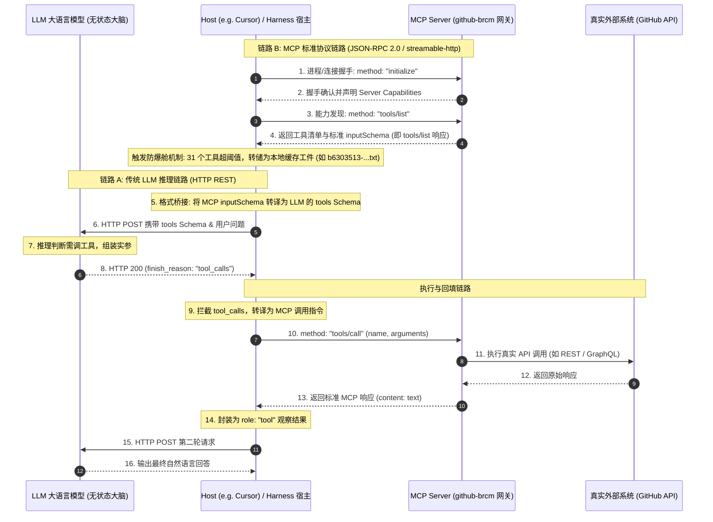

# MCP (Model Context Protocol) 架构定位、底层通信与工程落地深度解析

> **核心工程心智模型**:  
> **LLM 本身对 MCP 一无所知，也不跑 MCP 协议。**  
> MCP 是 AI 宿主（Host (e.g. Cursor) / Harness）与外部工具/数据源之间的**跨进程、跨语言标准化外设总线**（类似开发语言的 LSP，或 AI 时代的 USB-C 接口）。  
> 两段通信完全解耦：**Host (e.g. Cursor) 与 LLM 走标准模型推理 API（HTTP POST + tools Schema），Host (e.g. Cursor) 与 MCP Server 走统一的 JSON-RPC 2.0 协议（stdio / HTTP SSE）。**

---

## 🗺️ 一、 架构真相：MCP 到底处于哪一层？

在许多概念科普中，常将 MCP 与 LLM 工具调用（Tool Calling）混为一谈，甚至误认为“把 MCP 装进了大模型”。**这在架构认知上是错误的。**

### 1. 为什么需要 MCP？（解决 $M \times N$ 生态灾难）

- **传统模式（$M \times N$ 绑定）**：  
  如果 Cursor、Claude Desktop、Zed、以及各类私有 Agent 框架要接入 GitHub、Jira、Confluence 等工具，每一个客户端都要为每个工具各自编写专有的集成与适配逻辑。
- **MCP 模式（$M + N$ 标准化）**：  
  工具提供方仅需编写一次 **MCP Server**（可以用 Python、TypeScript、Go、Rust 实现）。任何支持 MCP 协议的宿主环境（Host (e.g. Cursor) / Harness）都能即插即用，零成本完成对接。

### 2. 双链路解耦时序图（以企业级 `github-brcm` MCP 为例）



---

## 🔌 二、 真实案例：`github-brcm` 运行时的 4 阶段通信报文还原

在实际生产环境（以当前环境配置的 `github-brcm` MCP Server 为例），其配置于 `~/.cursor/mcp.json`：
```json
{
  "mcpServers": {
    "github-brcm": {
      "type": "streamable-http",
      "url": "https://gateway-github-vcf.apps-tpcf-epic-gto.lvn.broadcom.net/github/mcp"
    }
  }
}
```

底层通信严格遵循 **JSON-RPC 2.0** 报文规范，通信全链路如下：

### 阶段 1：建立连接与握手初始化（Host (e.g. Cursor) ──► MCP Server）

Host (e.g. Cursor) 与远程网关建立 HTTP 长连接后，发起握手：

```json
{
  "jsonrpc": "2.0",
  "id": 1,
  "method": "initialize",
  "params": {
    "protocolVersion": "2024-11-05",
    "capabilities": {
      "roots": { "listChanged": true },
      "sampling": {}
    },
    "clientInfo": {
      "name": "Cursor-Harness",
      "version": "1.0.0"
    }
  }
}
```

`github-brcm` 网关返回服务信息与能力声明：

```json
{
  "jsonrpc": "2.0",
  "id": 1,
  "result": {
    "protocolVersion": "2024-11-05",
    "capabilities": {
      "tools": { "listChanged": true },
      "resources": { "subscribe": true }
    },
    "serverInfo": {
      "name": "github-brcm-gateway",
      "version": "1.2.0"
    }
  }
}
```

随后 Host (e.g. Cursor) 发送确认通知（Notification，无 id）：
```json
{
  "jsonrpc": "2.0",
  "method": "notifications/initialized"
}
```

---

### 阶段 2：工具发现与 `tools/list` 响应（能力清单）

Host (e.g. Cursor) 发送标准能力查询：
```json
{
  "jsonrpc": "2.0",
  "id": 2,
  "method": "tools/list",
  "params": {}
}
```

`github-brcm` 网关返回全部 31 个工具的完整清单。每个工具严格使用 **`inputSchema`**（JSON Schema 规范）定义入参：

```json
{
  "jsonrpc": "2.0",
  "id": 2,
  "result": {
    "tools": [
      {
        "name": "create_pull_request",
        "description": "Create a new pull request in a GitHub repository",
        "inputSchema": {
          "type": "object",
          "properties": {
            "owner": { "type": "string", "description": "Repository owner" },
            "repo": { "type": "string", "description": "Repository name" },
            "title": { "type": "string", "description": "Pull request title" },
            "head": { "type": "string", "description": "Branch where changes are" },
            "base": { "type": "string", "description": "Branch to pull into" },
            "body": { "type": "string", "description": "Pull request description" }
          },
          "required": ["owner", "repo", "title", "head", "base"]
        }
      },
      {
        "name": "add_comment_to_pending_review",
        "description": "Add review comment to the requester's latest pending pull request review...",
        "inputSchema": {
          "type": "object",
          "properties": {
            "owner": { "type": "string", "description": "Repository owner" },
            "repo": { "type": "string", "description": "Repository name" },
            "pullNumber": { "type": "number", "description": "Pull request number" },
            "path": { "type": "string", "description": "The relative path to the file" },
            "line": { "type": "number", "description": "The line of the blob in the diff" },
            "side": { "type": "string", "enum": ["LEFT", "RIGHT"] },
            "body": { "type": "string", "description": "The text of the review comment" }
          },
          "required": ["owner", "repo", "pullNumber", "path", "body"]
        }
      }
      // ... 共 31 个工具
    ]
  }
}
```

> 📌 **实体工件映射（Artifact Grounding）**：  
> 该步骤中网关回传的 31 个工具 JSON 报文体积达 **36.7 KB，1207 行**。Host (e.g. Cursor) 的 Harness 拦截后触发大文本防爆舱机制，将其转储在项目专属工件中：  
> `~/.cursor/projects/.../agent-tools/b6303513-1540-4aab-8348-e8f5e5b7193b.txt`  
> 该文件中的 `tools` 列表正是此处的 `tools/list` 返回结果。

---

### 阶段 3：格式桥接（Host (e.g. Cursor) 将 MCP `inputSchema` 转为 LLM `parameters`）

LLM 并不认识 MCP 的 `inputSchema`。Host (e.g. Cursor) 将其转译为 OpenAI / Anthropic 规范的标准 `tools` Schema：

```json
{
  "model": "gpt-4o",
  "messages": [
    {
      "role": "user",
      "content": "帮我在 vcf/dl-vm-test-automation 仓库中提一个 PR，将 topic/fix 分支合入 main"
    }
  ],
  "tools": [
    {
      "type": "function",
      "function": {
        "name": "create_pull_request",
        "description": "Create a new pull request in a GitHub repository",
        "parameters": {
          "type": "object",
          "properties": {
            "owner": { "type": "string", "description": "Repository owner" },
            "repo": { "type": "string", "description": "Repository name" },
            "title": { "type": "string", "description": "Pull request title" },
            "head": { "type": "string", "description": "Branch where changes are" },
            "base": { "type": "string", "description": "Branch to pull into" },
            "body": { "type": "string", "description": "Pull request description" }
          },
          "required": ["owner", "repo", "title", "head", "base"]
        }
      }
    }
  ]
}
```

---

### 阶段 4：意图转译与真正执行（Host (e.g. Cursor) ──► `github-brcm` 网关）

LLM 生成决断，返回 `tool_calls`：

```json
{
  "role": "assistant",
  "content": null,
  "tool_calls": [
    {
      "id": "call_pr_001",
      "type": "function",
      "function": {
        "name": "create_pull_request",
        "arguments": "{\"owner\":\"vcf\",\"repo\":\"dl-vm-test-automation\",\"title\":\"fix: resolve test flakiness\",\"head\":\"topic/fix\",\"base\":\"main\"}"
      }
    }
  ]
}
```

Host (e.g. Cursor) 拦截到该响应，从 arguments 反序列化出入参，向 `github-brcm` MCP 网关发送一条标准的 JSON-RPC `tools/call` 请求：

```json
{
  "jsonrpc": "2.0",
  "id": 3,
  "method": "tools/call",
  "params": {
    "name": "create_pull_request",
    "arguments": {
      "owner": "vcf",
      "repo": "dl-vm-test-automation",
      "title": "fix: resolve test flakiness",
      "head": "topic/fix",
      "base": "main"
    }
  }
}
```

`github-brcm` 网关执行完成并返回标准响应：

```json
{
  "jsonrpc": "2.0",
  "id": 3,
  "result": {
    "content": [
      {
        "type": "text",
        "text": "Pull request #88 created successfully: https://github-vcf.devops.broadcom.net/vcf/dl-vm-test-automation/pull/88"
      }
    ],
    "isError": false
  }
}
```

Host (e.g. Cursor) 取出 `content[0].text`，装配成 `role: "tool"` 发送给 LLM 生成人类可读的最终答复：
```json
{
  "role": "tool",
  "tool_call_id": "call_pr_001",
  "content": "Pull request #88 created successfully: https://github-vcf.devops.broadcom.net/vcf/dl-vm-test-automation/pull/88"
}
```

---

## 🏛️ 三、 MCP 的三大支柱（Beyond Tools）

MCP 的全称是 **Model Context Protocol（模型上下文协议）** 而非仅仅“工具协议”，因为它规范了 Agent 与外部世界交互的三种基本上下文原语：

| 原语 | 作用与心智模型 | 交互属性 | 类比 |
| :--- | :--- | :--- | :--- |
| **Tools（动作/执行）** | **可执行的、带有副作用的操作**。由 LLM 决定何时调用与入参组装（如发邮件、提 PR、写数据库）。 | 主动决策 (Active) | 相当于 HTTP 的 **POST / PUT / DELETE** |
| **Resources（只读数据源）** | **被动加载的数据或上下文**。由 Host (e.g. Cursor) 或用户主动挂载（如读取某文件、查询实时日志、加载 DB Schema），不产生副作用。 | 被动只读 (Passive) | 相当于 HTTP 的 **GET** |
| **Prompts（工作流模版）** | **由 Server 预置的专业交互模版**。例如 Git Server 自身提供一个 `commit-review` 模版，告诉 LLM 该如何审查 Diff 并撰写提交信息。 | 引导指令 (Instructional) | 相当于 IDE 中的 **Slash Commands**（如 `/review`） |

---

## 🔬 四、 工业级落地实战解析（以 Cursor 与企业级 `github-brcm` MCP 为例）

通过对 Cursor 运行时的真实配置、文件工件与底层数据库探查，揭示 MCP 在生产级 Agent 中的关键工程机制：

### 1. `tools/list` 返回结果落地：为什么会有 `agent-tools/*.txt` 文件？
在步骤 4 中，`github-brcm` MCP 网关返回了 31 个工具的完整定义，全展开高达 **1207 行（36.7 KB）**。  
如果 Host (e.g. Cursor) 直接将这 1200 多行原始数据直接作为 System Prompt 塞入当前聊天会话，会引发两个严重后果：
1. **上下文挤爆（Context Pollution）**：单次工具声明吃掉数千 Token，挤压有限的代码与会话窗口；
2. **TTFT 延迟骤增与成本浪费**。

**Cursor Harness 的防爆舱工程实现**：
1. **拦截与落盘**：检测到 MCP 工具定义体积过大，底层将其直接转储写入工件缓存：  
   `~/.cursor/projects/.../agent-tools/b6303513-1540-4aab-8348-e8f5e5b7193b.txt`
2. **指针回传**：仅向内部返回轻量级指针（`filePath` 与 `note: Large output has been written...`）。
3. **按需局部切片（Lazy Read）**：模型按需调用 `Read(offset, limit)` 分段读取工具 Schema，保持上下文极为轻量。

### 2. Cursor 内部工具 vs 标准 MCP 协议（`GetDynamicTools` vs `tools/list`）
* **`tools/list`**：是 **公开的标准 MCP 规范方法名**。所有合规的 MCP Server 必须实现该方法以暴露能力。
* **`GetDynamicTools`**：是 **Cursor IDE 注入给 LLM 的宿主原生工具**。LLM 通过调用 `GetDynamicTools({ "namespace": "user-github-brcm" })` 触发 Cursor Harness 去向远端网关执行一次真实的 `tools/list` 查询。

### 3. 企业级传输通道：`streamable-http` 网关
与本地运行的 `stdio` 管道不同，`github-brcm` 配置为：
```text
https://gateway-github-vcf.apps-tpcf-epic-gto.lvn.broadcom.net/github/mcp
```
这种集中式网关架构使多名开发者无需在本地配置繁杂的 Git 工具链或配置私有凭据，由统一内网网关代理与 GitHub Enterprise 通信。

### 4. 鉴权体系与安全存储（OAuth 与硬件级加密）
企业级 MCP 网关受 OAuth 2.0 Bearer Token 保护（直接访问返回 `401 Unauthorized` 并提示 `Www-Authenticate: Bearer`）。Cursor 的安全隔离设计：
* **数据库索引**：在 `~/Library/Application Support/Cursor/User/globalStorage/state.vscdb` 的 `ItemTable` 中记录 `mcpOAuth.secret.[user-github-brcm] mcp_tokens`。
* **硬件级主密钥加密**：物理值通过 Electron `safeStorage` 加密存储，主密钥由 **macOS Keychain（钥匙串）条目 `Cursor Safe Storage`** 硬件保护。在整个流程中，**LLM 从未接触真实的 Bearer Token**，鉴权报文头完全由外围 Harness 代为注入。

---

## 🛠️ 五、 手动实操与调试验证指南

如果想脱离 IDE，亲手抓包体验最纯粹的 MCP JSON-RPC 通信过程，推荐以下两种方式：

### 方式 1：终端 stdio 管道直接调试（零门槛）

使用 Node.js 启动一个无需鉴权的本地 MCP 样例：

```bash
npx -y @modelcontextprotocol/server-sqlite --test
```

在终端进程挂起等待输入时，**手动输入初始化握手报文并回车**：

```json
{"jsonrpc":"2.0","id":1,"method":"initialize","params":{"protocolVersion":"2024-11-05","capabilities":{},"clientInfo":{"name":"test-client","version":"1.0"}}}
```

紧接着**手动输入能力查询报文并回车**：

```json
{"jsonrpc":"2.0","id":2,"method":"tools/list","params":{}}
```

终端 stdout 会立刻回显包含 `read_query`, `write_query` 等标准 JSON Schema 的结果。

### 方式 2：使用官方 MCP Inspector 可视化调试

```bash
npx @modelcontextprotocol/inspector
```

打开本地可视化 UI，点击 **“List Tools”** 或发起 **“Call Tool”**，可以在 Network 面板完整审视每一次 JSON-RPC 的请求头、方法名与返回报文。

---

## 🔗 体系联动

- [[harness_definition|Harness 的精确定义与组件清单]]（MCP 充当 Harness 的标准外设扩展接口）
- [[ai_agent_book|《AI Agent Book》精读笔记与真实 API 工具调用闭环]]
- [[coding_agent_architecture|Coding Agent 核心架构与主流厂商方案对比]]
