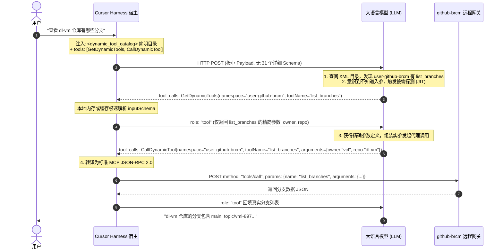

# 工具爆炸（Tool Explosion）与上下文治理：以 Cursor 工业实践为例

> **核心工程心智模型**:  
> **工具不是越多越好。直接暴露工具是线性成本，全量展开 Schema 是指数级灾难。**  
> 当外部工具扩展到几十甚至数百个时，朴素的“平铺注入（Flat Injection）”必然导致 **Token 账单爆炸、首字延迟（TTFT）飙升与注意力涣散（Tool Degradation）**。  
> 工业级 Harness（以 Cursor 为例）的解法是：**全局注册与单会话运行集解耦（Role-Based Pruning）+ 系统提示词极简索引（Prompt Catalog）+ 两阶段元工具代理（Meta-Tool Proxy & JIT Schema Expansion）+ 大文本防爆舱（Context Spilling）**。

---

## 💣 一、 工具爆炸的数学现实与工程困境

### 1. 为什么“平铺注入”在生产中不可行？

在真实的软件研发场景中，Agent 需要接入的能力极其庞大：

- **Cursor 全局内置原生工具**：底层代码（/Applications/Cursor.app/Contents/Resources/app/extensions/cursor-agent-host/dist/477.js）静态注册了 **48 个**工具（涵盖文件编辑、子智能体调度、CI 审查、长程自治、模式切换等）；
- **企业级 GitHub MCP (**`github-brcm`**)**：31 个工具（从创建分支、提 PR 到代码行级 Review）；
- **企业级 Jira MCP (**`vmw-jira`**)**：20 个工具（Issue 增删改查、Sprint 规划、工作流流转）；
- **企业级 Confluence MCP (**`vmw-confluence-brcm`**)**：10 个工具（空间搜索、页面读写）；
- **其他专用工具与 Skills**：数以十计。

两者相加，一个完整企业级 Agent 开发者手头总共有 **100+ 个候选工具**。

如果采用新手教程中常见的朴素方案——在每一轮向大模型发起 HTTP POST 时，把这 **100+ 个工具（48 个原生 + 60+ 个外部 MCP）的完整 JSON Schema 全量填入** `tools: [...]` **数组**：

$$\text{单轮工具开销} \approx 100+ \text{ 个工具} \times 400 \sim 800 \text{ Token/工具} \approx \mathbf{40,000 \sim 80,000+ \text{ Token/轮}}$$

### 2. 引发的三大致命工程后果

```
┌────────────────────────────────────────────────────────────────────────┐
│                        平铺注入 (Flat Injection) 危机                   │
├───────────────────┬───────────────────────────────┬────────────────────┤
│   1. 财务成本失控   │       2. 响应延迟雪崩         │  3. 模型认知崩溃    │
├───────────────────┼───────────────────────────────┼────────────────────┤
│ • 每轮交互白白损耗 │ • TTFT (首字生成时间) 从 1 秒  │ • 选项过多导致注意 │
│   几万 Token 账单  │   恶化至 5~8 秒               │   力漂移 (Lost in  │
│ • 多轮迭代成本呈算 │ • 大模型预填充 (Prefill) 计算 │   the Middle)      │
│   术级/几何级剧增   │   量过载，影响交互心流        │ • 参数幻觉与选错工具│
└───────────────────┴───────────────────────────────┴────────────────────┘
```

---

## 🏛️ 二、 Cursor 解决工具爆炸的三代架构演进

Cursor 在解决这一工业级难题的过程中，经历过清晰的迭代轨迹：

```
V0 朴素平铺阶段 (Naive Flat Injection)
   │  • 将所有工具 JSON Schema 塞入 tools: [...]
   ▼  • 缺陷：接入 3 个 MCP 即突破上下文极限
V1 虚拟文件系统阶段 (MCP FileSystem Mode，见开源泄漏 cursor.md)
   │  • 将 Schema 存为虚拟 JSON 描述文件：{mcps_folder}/<server>/tools/<name>.json
   │  • 模型用 Read 读文件，用统一代理 CallMcpTool 执行
   ▼  • 缺陷：频繁磁盘 I/O、虚拟文件同步失效、污染工作区文件读取历史
V2 动态命名空间与元代理阶段 (Current Dynamic Namespaces - 现行架构)
      • 压缩索引：System Prompt 注入仅含工具名的紧凑 XML 目录 (<dynamic_tool_catalog>)
      • 元工具代理：tools: [...] 仅保留 2 个通用网关 (GetDynamicTools + CallDynamicTool)
      • JIT 懒加载：两阶段即时拉取精准 Schema 并代理执行
```

---

## 🔬 三、 Cursor 现行架构的四大防御工事（Deep Reverse-Engineering）

通过反编译与逆向分析你 Mac 上当前运行的 `/Applications/Cursor.app` 底层核心库（`/Applications/Cursor.app/Contents/Resources/app/extensions/cursor-agent-host/dist/477.js`）及实际网络报文，完整还原 Cursor 的工程实现细节：

```
┌──────────────────────────────────────────────────────────────────────────────────┐
│                             Cursor 工具治理四大防御工事                          │
├──────────────────────────────────────────────────────────────────────────────────┤
│ 防线 1: 全局 48 个内置工具分角色裁剪 (Role-Based Pruning)                         │
│         主会话仅下发 ~15 个通用工具，子智能体/评测机各司其职                     │
├──────────────────────────────────────────────────────────────────────────────────┤
│ 防线 2: System Prompt 极简目录索引 (<dynamic_tool_catalog>)                      │
│         仅罗列命名空间与函数名，剔除所有 inputSchema，Token 压缩率 > 98%         │
├──────────────────────────────────────────────────────────────────────────────────┤
│ 防线 3: 两阶段元工具代理 (GetDynamicTools + CallDynamicTool)                      │
│         阶段一探测精准参数，阶段二统一网关透传，HTTP tools 参数固定仅 2 个        │
├──────────────────────────────────────────────────────────────────────────────────┤
│ 防线 4: 大文本防爆舱机制 (Context Spilling & Lazy Read)                          │
│         Schema 响应超阈值自动拦截转储为 agent-tools/*.txt，回传指针按需切片读取   │
└──────────────────────────────────────────────────────────────────────────────────┘
```

---

### 防线 1：全局 48 个内置工具分角色裁剪（Role-Based Pruning）

在 Cursor 客户端的核心源码 `cursor-agent-host/dist/477.js` 中，通过内部工厂函数 `qO(...)` 注册了 **48 个静态内置工具**：

```javascript
// 提取自 /Applications/Cursor.app/.../dist/477.js
// 底层注册的全部静态工具类型
[
  'ADOPT', 'APPLY_PATCH', 'ASK_QUESTION', 'CODE_LINEAGE', 'CONNECT_SCM',
  'CREATE_GOAL', 'CREATE_PLAN_V2', 'CREATE_TASK', 'DELETE', 'EDIT_NOTEBOOK',
  'GENERATE_IMAGE', 'GET_MCP_TOOLS', 'GET_PR_CODE_TOUR', 'GLOB', 'GREP',
  'MCP', 'MINI_SWE_AGENT_BASH', 'PI_BASH', 'PI_EDIT', 'PI_FIND', 'PI_GREP',
  'PI_LS', 'PI_READ', 'PI_WRITE', 'READ_LINTS', 'RECORD_CI_INVESTIGATION_FINDINGS',
  'RECORD_SCREEN', 'REFLECT_GENERAL', 'REPLACE_ENV', 'REPORT_BUGFIX_RESULTS',
  'SEARCH_CONVERSATIONS', 'SEMANTIC_SEARCH', 'SEND_MESSAGE', 'SEND_TO_TASK',
  'SEND_TO_USER', 'SETUP_VM_ENVIRONMENT', 'SET_ACTIVE_BRANCH', 'SHELL',
  'START_GRIND_EXECUTION', 'START_GRIND_PLANNING', 'STR_REPLACE', 'SWITCH_MODE',
  'TASK', 'TODO_WRITE', 'UPDATE_GOAL', 'UPDATE_PR_CODE_TOUR', 'WEB_FETCH',
  'WEB_SEARCH', 'WRITE'
]
```

#### 分工裁剪逻辑

Cursor Harness **绝不会将这 48 个工具一次性全塞给当前会话**，而是实施了严格的“上下文防火墙”：

1. **主对话工作集（Session Working Set，约 15 个）**：
  `Read`, `Write`, `StrReplace`, `Glob`, `Grep`, `Shell`, `Delete`, `ReadLints`, `TodoWrite`, `AskQuestion`, `SwitchMode`, `WebSearch`, `WebFetch`, `GetDynamicTools`, `CallDynamicTool`。
2. **轻量级后台子智能体工作集（Pi-Agent Tools）**：
  `PI_BASH`, `PI_EDIT`, `PI_FIND`, `PI_GREP`, `PI_LS`, `PI_READ`, `PI_WRITE`。主会话不可见，派生后台扫描大型代码库时按需给子智能体发放。
3. **CI 审查与调查工作集（Bugbot / CI Verifiers）**：
  `RECORD_CI_INVESTIGATION_FINDINGS`, `REPORT_BUGFIX_RESULTS`。仅在后台自动化对抗审查（Adversarial Review）运行时代发。
4. **长程自主自治工作集（Grind Mode）**：
  `START_GRIND_PLANNING`, `START_GRIND_EXECUTION`, `CREATE_PLAN_V2`。用于脱离人类交互的持续重构与测试循环。
5. **父子通信与拓扑流转工作集**：
  `SEND_TO_TASK`（向父智能体汇报）、`SEND_TO_USER`（向终端人类汇报）。

#### 关键辨析：全局 48 个内置工具 vs 主对话约 15 个工具矛盾吗

**完全不矛盾。这正是“全集储备（Inventory）”与“投影工作集（Working Set）”的设计解耦：**

- **全集（48 个）**：是 Cursor 客户端 IDE 内核底层**实现的全部内置工具总库**，涵盖了主会话、后台轻量子智能体、CI 审查机器人、自动化长程自治循环等多套子系统。
- **投影工作集（约 15 个）**：是当前主会话面对开发者日常交互时，**按最小特权原则激活的具体沙箱**。

##### 为什么绝不能把 48 个工具全量塞入主会话

1. **防止注意力涣散与工具误选（Attention Distraction）**：48 个工具描述极其庞杂。若全量平铺，大模型在处理普通前端样式或业务代码时，极易因注意力漂移而误调用本用于后台 CI 判定的 `RECORD_CI_INVESTIGATION_FINDINGS` 或子智能体专用的 `PI_BASH`。
2. **防止拓扑越权与逻辑死锁（Topology & Privilege Breach）**：例如父子通信工具 `SEND_TO_TASK`（向父智能体汇报）只能在子节点运行。若暴露给没有父会话的主智能体，一旦模型误触发，系统将因找不到父路由而直接死锁或崩溃。
3. **消除底包 Token 冗余浪费**：48 个工具的完整 JSON Schema 展开将直接吞掉 5,000~8,000 Token。将它们常驻在每一轮对话的请求体中，会造成高昂的费用与网络延迟开销。

> **军械库比喻**：军械库储备有 48 种装备（狙击步枪、侦察无人机、重型火炮、工兵铲等）。但派遣一名“随身工程兵”（主会话 Agent）出门时，军械库只会配发工兵铲、扳手、卷尺等约 15 件最趁手的基础工具；只有派出“侦察分队”（Pi-Agent）时才会单独配发传感器（`PI_FIND`, `PI_GREP`）。严格践行了软件工程与安全领域的 **最小特权原则（Principle of Least Privilege）**。

---

### 防线 2：System Prompt 极简目录索引（Prompt Catalog）

对于挂载的外部海量 MCP 服务（如当前配置的 `github-brcm` 31 个工具 + `vmw-jira` + `vmw-confluence-brcm`），Cursor **彻底剥离所有详细参数结构**，只在系统提示词开头注入极简的 XML 目录：

```xml
<dynamic_tool_catalog>
These dynamic tool namespaces were available when this conversation started. Availability may have changed, so use `GetDynamicTools` to check current state before calling `CallDynamicTool`.

<dynamic_tool_namespaces>
  <namespace name="user-github-brcm" 
             tools="add_comment_to_pending_review, create_branch, create_or_update_file, create_pull_request, create_repository, delete_file, fork_repository, get_commit, get_file_contents, get_latest_release, get_me, get_release_by_tag, get_tag, get_team_members, get_teams, list_branches, list_commits, list_pull_requests, list_releases, list_tags, merge_pull_request, pull_request_read, pull_request_review_write, push_files, request_copilot_review, search_code, search_orgs, search_pull_requests, search_repositories, update_pull_request, update_pull_request_branch" 
             namespaceUseInstructions="The GitHub MCP Server provides tools to interact with GitHub platform..." />
  <namespace name="user-vmw-jira" 
             tools="jira_get_projects, jira_get_boards, jira_get_board_issues, ..." />
  <namespace name="user-vmw-confluence-brcm" 
             tools="get_page, get_page_by_space_and_title, search_pages" />
</dynamic_tool_namespaces>
</dynamic_tool_catalog>
```

- **效果**：31 个 GitHub 高级能力在提示词中仅占 **不到 150 个 Token**，压缩比高达 **98.5%**！

#### 关键辨析：`<dynamic_tool_catalog>` 与 `<dynamic_tools>` 的协作关系

在 Cursor 的 System Prompt 文本中，同时存在 `<dynamic_tool_catalog>` 与 `<dynamic_tools>` 两个标签。它们不是重复，而是一“数”一“文”的互补关系：

| 维度 | `<dynamic_tool_catalog>` (工具目录) | `<dynamic_tools>` (工具协议) |
| :--- | :--- | :--- |
| **本质定位** | **数据清单 / 资产索引（Data Manifest / What exists）** | **行为规范 / 交互协议（Instruction Protocol / How to operate）** |
| **在 Prompt 中的位置** | 处于提示词前部（上下文信息区） | 处于提示词后部（核心工具规则与约束区） |
| **核心承载内容** | 列出当前已连接的 MCP Server 名字、命名空间、以及所有可用的工具名摘要。 | 严格规定使用 `GetDynamicTools` 和 `CallDynamicTool` 的两阶段协议（禁止盲调、先查参数后调用、RE2 正则模式、认证失效处理等）。 |
| **动态性特征** | **随配置动态变化**：用户在本地增删一个 MCP Server，目录行增减；断开连接即消失。 | **相对静态模版**：写在 `477.js` 代码模版中的通用协议逻辑，只要开启了动态工具支持便恒定注入。 |

##### 协同链路还原

1. **认知唤起（What）**：用户发出指令“帮我查一下 dl-vm 仓库的最新分支”。大模型检索 `<dynamic_tool_catalog>` 发现 `user-github-brcm` 命名空间下确实存在 `list_branches` 工具名。
2. **行为约束（How）**：大模型受 `<dynamic_tools>` 规则约束，明确知道“自己只知道工具名，绝不知道它的入参结构，严禁盲目猜参”，因此触发第一阶段调用：`GetDynamicTools(namespace="user-github-brcm", toolName="list_branches")` 获取 Schema。

---

### 防线 3：两阶段元工具代理（Meta-Tool Proxy & JIT Expansion）

很多开发者初看 Cursor 架构时常有疑问：**“为什么一边说是 HTTP POST 参数，另一边源码佐证却是一段 Prompt 模版？这两者到底是什么关系？”**

这背后是 Cursor 针对工具治理设计的核心机制——**双通道工具架构（Dual-Channel Tooling Architecture）**。

#### 1. 概念解耦：认知通道 vs 契约通道

大模型（LLM）发起一次合法的工具调用，必须在两个维度同时满足条件：

- **认知通道（Brain / 自然语言层）**：模型必须在思维链中“知道”外部有哪些服务存在、该用什么工具、以及先查后调的规则。这必须通过 **System Prompt（提示词文本）** 来灌输。
- **契约通道（Hands / 语法解码层）**：模型的采样解码器（Grammar Engine）必须在 **HTTP POST `tools: [...]` 数组** 中有合法的 Function Calling JSON Schema，否则模型无法解码输出合法的 JSON 工具调用格式。

Cursor **将两层彻底解耦**：认知层只给极简目录与使用说明，契约层则只给 2 个通用的“元工具（Meta-Tools）”，模型想调用任何海量外部工具，都必须经由这两个元工具中转。

---

#### 2. 通道二（契约层）：HTTP POST 根参数中的两个标准元工具

在发往大模型 API（如 Anthropic / OpenAI）的 HTTP POST 报文中，无论用户配置了多少个 MCP Server（数十个服务、数百个工具），根参数 `tools: [...]` 数组中**永远不会出现具体的业务工具名（如 `create_pull_request`、`jira_create_issue`）**。

取而代之的是，Cursor 固定注入两个标准元工具，作为模型调用任意动态工具的“通用操作手”：

```json
{
  "tools": [
    // ... 约 15 个本地核心开发工具 (Read, Write, Grep, Shell, ReadLints 等) ...
    {
      "type": "function",
      "function": {
        "name": "GetDynamicTools",
        "description": "Discover and inspect tools available through dynamic namespaces (MCP). Supports full schema lookup by namespace and toolName.",
        "parameters": {
          "type": "object",
          "properties": {
            "namespace": { "type": "string", "description": "Dynamic namespace to inspect, e.g. an MCP server." },
            "toolName": { "type": "string", "description": "Tool name within the namespace." },
            "pattern": { "type": "string", "description": "Regex pattern to search namespace and tool names." }
          }
        }
      }
    },
    {
      "type": "function",
      "function": {
        "name": "CallDynamicTool",
        "description": "Invoke one tool from a dynamic namespace, e.g. an MCP server. Always inspect tool schema before calling.",
        "parameters": {
          "type": "object",
          "properties": {
            "namespace": { "type": "string", "description": "Dynamic namespace hosting the tool." },
            "toolName": { "type": "string", "description": "Name of the tool to invoke." },
            "arguments": { "type": "object", "description": "Arguments to pass to the tool." }
          },
          "required": ["namespace", "toolName", "arguments"]
        }
      }
    }
  ]
}
```

---

#### 3. 通道一（认知层）与数据流串联：477.js 源码实现全解析

在 Cursor 核心运行时（`/Applications/Cursor.app/.../cursor-agent-host/dist/477.js`）中，Prompt 模板与 HTTP POST 参数是通过一套严密的**元角色（Meta Role）机制**在代码中自动串联起来的：

##### ① 元工具定义与角色打标（Registration）

在本地静态工具注册表里，Cursor 将这两个元工具打上专门的角色标记 `dynamicToolMetaRole`：

```javascript
// 提取自 477.js Line 74794 (探测元工具注册)
qO("GET_MCP_TOOLS", {
  name: "GetDynamicTools",
  dynamicToolMetaRole: "discovery", // 标注元角色为：探测
  description: "Discover and inspect tools available through dynamic namespaces, e.g. MCP servers...",
  parameters: { /* server/namespace, toolName, pattern */ },
  execute: async (ctx, args) => { /* 本地缓存/内存即时反射查询 Schema */ }
});

// 提取自 477.js Line 33071 (调用元工具注册)
qO("MCP", {
  name: "CallDynamicTool",
  dynamicToolMetaRole: "invocation", // 标注元角色为：调用执行
  description: "Invoke one tool from a dynamic namespace, e.g. an MCP server...",
  parameters: { namespace, toolName, arguments },
  execute: async (ctx, args) => { /* 转换为标准 MCP JSON-RPC 2.0 发给远端进程 */ }
});
```

##### ② 动态提取名称并拼装 Prompt 规则模板（Prompt Channel）

在为大模型组装 System Prompt 时，Harness 会调用 `r$(tools)` 自动提取出带有 `discovery` 和 `invocation` 角色的工具名，并插值填入 `<dynamic_tools>` 自然语言规则指令中：

```javascript
// 提取自 477.js Line 35546
function r$(tools) {
  const staticTools = tools.getStaticTools();
  const discoveryToolName = staticTools.find(t => t.dynamicToolMetaRole === "discovery")?.name;   // "GetDynamicTools"
  const invocationToolName = staticTools.find(t => t.dynamicToolMetaRole === "invocation")?.name; // "CallDynamicTool"
  return { discoveryToolName, invocationToolName };
}

// 提取自 477.js Line 35528 (生成塞入 messages[0].content 的 System Prompt)
`<dynamic_tools>
You have access to tools through dynamic namespaces, e.g. MCP servers, using \`${e.discoveryToolName}\` and \`${e.invocationToolName}\`.

## Dynamic Tool Discovery and Invocation
Use \`${e.discoveryToolName}\` to discover tool schemas, then \`${e.invocationToolName}\` to invoke one tool. Aim to minimize round-trips: ideally one discovery call followed by one invocation.

MANDATORY - Always call \`${e.discoveryToolName}\` to discover a tool's schema before invoking it with \`${e.invocationToolName}\`.
</dynamic_tools>`
```

> **对大模型的作用**：这段自然语言告诉 LLM——*“系统里存在外部动态工具。你要用的时候，必须遵守‘两阶段协议’：第一步先拿 `${discoveryToolName}` 查参数定义，第二步再拿 `${invocationToolName}` 发起调用！”*

##### ③ HTTP 请求组装时的严格隔离过滤（API Channel）

当 Harness 真正通过 HTTP POST 向大模型推理服务（`InferenceService.Stream`）发起调用时，它做了一次关键的**工具裁剪**：

```javascript
// 提取自 477.js Line 53131 & 54762
// 发送给模型 API 时，仅暴露静态工具集（含两个元工具），所有几百个动态 MCP 工具全部被遮蔽过滤！
const requestPayload = {
  messages: [
    // 包含 System Prompt (里面有 <dynamic_tool_catalog> 目录和 <dynamic_tools> 规则)
    { role: "system", content: systemPrompt },
    { role: "user", content: userQuery }
  ],
  // 最终的 HTTP POST tools 字段：
  tools: C.getStaticTools().map(t => ({
    type: "function",
    function: {
      name: t.name,               // 包含 GetDynamicTools, CallDynamicTool, Read, Write...
      description: t.description,
      parameters: t.parameters
    }
  }))
};
```

---

#### 4. 执行流程双阶段还原

通过上述解耦设计，一次针对外部海量工具的调用被分成了两个极小开销的阶段：

1. **阶段一：即时探测（JIT Discovery）**
  - 模型在 System Prompt 的 XML 目录中看到了 `user-github-brcm` 下有 `list_branches`，但当前 HTTP `tools` 参数中没有该工具的入参 Schema。
  - 依据 Prompt 规则，模型发出元工具调用：
  `GetDynamicTools({ namespace: "user-github-brcm", toolName: "list_branches" })`
  - Cursor Harness 在本地内存中毫秒级解析出该工具的精简入参（`owner`、`repo`），以 `role: "tool"` 迅速回填给模型上下文。
2. **阶段二：代理执行（Proxy Invocation）**
  - 模型拿到了入参规范，拼装具体实参并发起元工具执行调用：
   `CallDynamicTool({ namespace: "user-github-brcm", toolName: "list_branches", arguments: { owner: "vcf", repo: "dl-vm" } })`
  - Cursor Harness 在本地拦截后，转译为标准 MCP JSON-RPC 2.0 请求（`tools/call`）通过 IPC/STDIO 发给后端的 GitHub MCP 进程，并将真实结果返回给模型。

**收益**：HTTP POST 的 `tools` 请求体体积被锁死在 **~15 KB**，无论后端接入多少个 MCP Server，大模型永远不会发生工具爆炸。

---

### 防线 4：大文本防爆舱机制（Context Spilling）

当 LLM 确实需要某个复杂工具或查看某个命名空间的所有能力时（例如查询 `user-github-brcm`），网关返回的完整 JSON 报文可能高达几十 KB（如 31 个工具展开达 **36.7 KB，1207 行**）。

#### Cursor Harness 拦截机制：

1. **体积阈值截断**：Cursor 检测到 `GetDynamicTools` 或任何命令行输出体积过大时，**拒绝将原始字符串直接回填进上下文**；
2. **转储为物理工件**：自动在本地临时存储区落盘生成缓存文件，例如：
  `~/.cursor/projects/.../agent-tools/b6303513-1540-4aab-8348-e8f5e5b7193b.txt`
3. **回传轻量指针**：只给大模型回传：
  ```json
   {
     "filePath": "/Users/zyajing/.../agent-tools/b6303513-1540-4aab-8348-e8f5e5b7193b.txt",
     "note": "Large output has been written to: ... (36.7 KB, 1207 lines)"
   }
  ```
4. **局部惰性切片（Lazy Read）**：模型随后调用 `Read` 工具带 `offset` 和 `limit` 只读出它当下需要的某几行 Schema，完美守住了 Context Window。

#### 深入剖析：Read 工具的“局部惰性切片”与 offset / limit 计算机制

当面对大文件（无论是庞大的项目源码还是转储的 Schema 工件）时，Agent 频繁调用 `Read` 工具并配合 `offset` 和 `limit`。这一机制在 Cursor 源码（`477.js`）中有极严密的工程设计：

##### 1. 十万字符防御熔断（100,000 Characters Limit）

在 `477.js` 第 68149 行与 68265 行，Cursor 设置了硬性的单次输出安全上限：

```javascript
// 提取自 477.js Line 68149 & Line 68265
const g8 = 1e5; // 100,000 字符 (约 100 KB，折合大模型 20,000 ~ 25,000 Tokens)

function $8(content, totalLines, fileSize, path, readRange, includeLineNumbers) {
  // 如果读取的内容超过 100,000 字符，直接触发熔断
  return content.length > g8 ? new Dg.uX({
    result: {
      case: "success",
      value: new Dg.A2({
        output: { case: "content", value: "" }, // 彻底清空输出内容，不向上下文泄露无用字符！
        exceededLimit: !0,                     // 标记超出限制
        fileSize: fileSize,
        ...
      })
    }
  }) : ...
}
```

触发该熔断时，Harness 会抛出标准提示：
> *"File content (XXXX characters) exceeds maximum allowed characters (100000 characters). Please use offset and limit parameters to read specific portions of the file, or use the 'grep' tool to search for specific content."*

**设计思考**：如果一个文件有 200 万字符，普通 Agent 框架往往粗暴地截取前 10 万字符喂给 LLM。但这极其危险——模型拿到的可能只是无意义的 Webpack 打包前缀或许可证注释，却误以为这就是文件的完整内容。Cursor Harness 宁可**清空输出报错**，倒逼大模型改用 `Grep` 检索关键词定位行号，或使用 `offset + limit` 进行局部切片。

##### 2. offset 与 limit 的底层计算算法（源码还原）

在 `477.js` 的 `B8` 函数（Line 68308）中，完整实现了行号坐标向底层数组切片下标的映射算法：

```javascript
// 提取自 477.js Line 68308
function B8(totalLines, offset, limit) {
  if (void 0 === offset && void 0 === limit) return;
  
  // 1. offset 缺省时默认从第 1 行开始
  const o = offset ?? 1;
  
  // 2. limit 缺省时的智能推导：
  //    如果提供了负数 offset（从尾部倒数），limit 默认等于其绝对值（直接读到文件末尾）；
  //    如果是正数 offset，limit 默认等于文件总行数（从当前行一直读到文件末尾）。
  const r = limit ?? (o < 0 ? Math.abs(o) : totalLines);
  
  // 3. 将 1-based 行号换算为 JS 数组的 0-based 下标 startIndex
  const startIndex = o < 0 ? Math.max(0, totalLines + o) : Math.max(0, o - 1);
  
  // 4. 计算结束下标 endIndex（防止越界）
  const endIndex = Math.min(totalLines, startIndex + r);
  
  // 5. 越界异常检查
  if (startIndex >= totalLines) {
    throw new GO(`Offset ${offset} is beyond file length (${totalLines} lines)`);
  }
  
  return {
    startIndex: startIndex,
    endIndex: endIndex,
    readRange: {
      startLine: startIndex + 1, // 还原为对人类/模型友好的 1-based 物理行号
      endLine: endIndex
    }
  };
}
```

- **`offset`（起始行号）**：
  - **正整数（`offset >= 1`）**：从文件头部按物理行号 1-indexed 开始。`offset: 1` 对应第 1 行，`offset: 100` 对应第 100 行。
  - **负整数（`offset <= -1`）**：从文件尾部向前倒数。例如总行数 1000 行，`offset: -50` 表示从倒数第 50 行（即第 951 行）读到文件末尾（相当于 Linux 的 `tail -n 50`）。
  - **零值容错**：若意外传入 `offset: 0`，校验层会自动规整为 `1`。
- **`limit`（读取行数）**：从 `offset` 算起连续读取的物理行数，在数组层面执行 `lines.slice(startIndex, startIndex + limit)`。

##### 3. offset 和 limit 的数值是如何确定的

`offset` 与 `limit` 的生成是 **大模型认知决策** 与 **Harness 宿主规则推导** 协同运作的结果：

| 决策方 | 职责与定位 | 典型机制 |
| :--- | :--- | :--- |
| **大语言模型 (Agent)** | **核心决策者**（生成具体数值） | 根据用户意图、Grep 检索出的行号锚点、报错堆栈，自主计算出最合理的切片视窗。 |
| **Cursor Harness** | **约束与兜底者**（规整与执行） | 负责缺省推导、负数解析、参数合法性规整，并在超出物理边界时保护。 |

###### Agent 决定数值的四大核心策略

1. **锚点定位法（Context Anchoring，最常用）**：
   Agent 通常先调用 `Grep` 定位关键字（例如找到目标函数位于第 79489 行），然后在思维链中进行心算：
   - $\text{offset} = \text{目标锚点行} - \text{上文裕量} \approx 79489 - 4 = 79485$
   - $\text{limit} = \text{上下文所需跨度} \approx 60 \sim 100$
   - 生成调用：`Read(path="...", offset=79485, limit=75)`。
2. **头尾探针采样法（Head / Tail Sampling）**：
   对未知结构的大文件：头部读 `offset: 1, limit: 50` 探查配置和 Imports；尾部读 `offset: -50, limit: 50` 探查导出接口或最新日志。
3. **滑动窗口翻页（Sliding Window Paging）**：
   当一次读取未能完整涵盖长函数或代码块时，模型流水线式滚动翻页：$\text{offset}_{t+1} = \text{offset}_t + \text{limit}_t$。
4. **Token 预算与行密度估算（Line-to-Token Sizing）**：
   代码平均每行约 40~80 字符，100 行约占用 1,500~2,000 Token。Agent 通常将单次 `limit` 自发约束在 **`50 ~ 200` 行**，既能完整看懂闭包逻辑，又绝不浪费宝贵的上下文预算。

##### 4. 绝对行号锁定与缺失态感知（Context Preservation）

在完成切片回填给大模型时，Cursor 并不会返回一份从 1 开始编号的新文本，而是保留其**全局绝对物理行号**：

```text
... 119 lines not shown ...
  120| const a = 1;
  121| const b = 2;
  122| function foo() { ... }
... 840 lines not shown ...
```

- **绝对行号（Absolute Line Numbering）**：行号前缀严格保持文件原始序号（如 `120|`），确保模型后续调用 `StrReplace`、代码对比或向用户引用行号时，坐标绝不发生漂移。
- **缺失态提示（Truncation Notice）**：明确标注前后省略了多少行，消除模型对外部依赖是否存在的幻觉。

---

## 🔄 四、 端到端执行闭环（时序交互还原）

以下以用户指令 *“帮我查一下 dl-vm 仓库的最新分支列表”* 为例，还原从极简索引到执行完成的真实链路：



### 关键机制深入：形参规范（Schema）与实参推导（Grounding）是如何绑定的？

初看时序图第 3 步时常有疑问：*“为什么 `GetDynamicTools` 刚查完参数，模型就知道向里面填入 `owner: 'vcf'` 和 `repo: 'dl-vm'`？难道接口能未卜先知？”*

这里必须严格区分两个概念：

- **形参结构规范（Parameter Schema / Shape）**：这个工具**需要**什么参数、什么类型？（由 `GetDynamicTools` 从 MCP 网关反射返回）
- **实参具体取值（Argument Values / Grounding）**：具体的参数字段**填**什么具体的值？（由大模型结合当前环境、用户指令、历史记忆进行实体解析推导）

```text
                               大语言模型 (LLM)
                                      │
            ┌─────────────────────────┼─────────────────────────┐
            │                         │                         │
            ▼                         ▼                         ▼
   【渠道 1：用户指令】      【渠道 2：工作区 Git 元数据】  【渠道 3：前置自省/探测】
   "查一下 dl-vm 的分支"      git remote -v -> vcf/dl-vm     get_me / search_repo
            │                         │                         │
            └─────────────────────────┼─────────────────────────┘
                                      │ (实体对齐推理 Entity Grounding)
                                      ▼
                      组装实参发起 CallDynamicTool:
                      { owner: "vcf", repo: "dl-vm" }
```

#### 实参值的 4 大来源渠道

1. **用户自然语言实体抽取（NER）**：
   用户原话输入：*“帮我查一下 **dl-vm** 仓库的最新分支列表”*。大模型具有出色的命名实体识别能力，在拿到 `list_branches` 的形参描述 `repo: The name of the repository` 后，立即完成第一层语义映射：$\text{repo} = \text{"dl-vm"}$。

2. **Cursor 工作区 Git 上下文自动感知（Workspace Git Context）**：
   用户只提了仓库名 `dl-vm`，并未说明 Organization/Owner 是 `vcf` 还是 `google`。Cursor Harness 在初始化对话轮次时，会自动抓取当前工作区的 Git 远程地址注入给模型：

   ```text
   <user_info>
   Workspace Path: /Users/zyajing/.../dl-vm
   Is directory a git repo: Yes
   Git Remote: origin -> git@github.com:vcf/dl-vm.git
   </user_info>
   ```

   大模型从当前的 Remote URL 中自然推导出该仓库隶属于组织 **`vcf`**。
3. **两阶段链路的前置自省与探测（Pre-flight Tool Introspection）**：
   若用户查询的是一个不属于当前本地工作区的陌生外部仓库，且未提供组织名，模型会根据 MCP 协议规则自发触发前置探测链：
   - **调用 `get_me` 探测权限**：GitHub MCP 规范强调 *“Always call 'get_me' first to understand current user permissions and context”*，先探明当前 Token 所属的个人或组织空间；
   - **调用 `search_repositories` 模糊搜索**：发起 `search_repositories(query="dl-vm")`，从返回的列表清单 `[{ full_name: "vcf/dl-vm", owner: "vcf" }]` 中锁定命名空间。
4. **多轮对话短期记忆复用（Conversation Memory）**：
   复用本轮之前已经讨论过的 Issue、PR 链接或前几轮提及的具体仓库实体信息。

#### 完整报文交接对比

将两阶段的 JSON 报文并列比对，数据流的流转便一目了然：

##### 第一阶段：GetDynamicTools 返回形参定义（工具需要什么）

```json
{
  "name": "list_branches",
  "description": "List branches in a GitHub repository",
  "inputSchema": {
    "type": "object",
    "properties": {
      "owner": { "type": "string", "description": "The account owner of the repository." },
      "repo": { "type": "string", "description": "The name of the repository without .git." }
    },
    "required": ["owner", "repo"]
  }
}
```

##### 第二阶段：LLM 结合上下文推理实参，发起 CallDynamicTool（给工具填什么值）

```json
{
  "name": "CallDynamicTool",
  "arguments": {
    "namespace": "user-github-brcm",
    "toolName": "list_branches",
    "arguments": {
      "owner": "vcf",
      "repo": "dl-vm"
    }
  }
}
```

---

## 📊 五、 架构对比与收益总结


| 评估维度                         | 方案 A：平铺全量注入（Naive Flat）         | 方案 B：MCP FileSystem（Cursor 早期 V1） | 方案 C：动态命名空间 + 元代理（Cursor 现行 V2）                     |
| ---------------------------- | ------------------------------- | --------------------------------- | --------------------------------------------------- |
| **HTTP POST** `tools` **体积** | **数百 KB**（随工具数量无上限暴涨）           | 中等（仅含基本工具 + CallMcpTool）          | **恒定约 15 KB**（仅角色裁剪后的核心工作集 ~15 工具 + 2 个 Meta-Tools） |
| **单轮 Token 开销**              | 额外消耗 **30,000 ~ 50,000+** Token | 读 Schema 消耗大量通用文件 Token           | 目录仅消耗 **200 ~ 500** Token，按需展开                      |
| **扩展极限**                     | 接入 2~3 个 MCP 就会击穿上下文            | 依赖本地虚拟文件，易产生不同步                   | **可轻松挂载上百个 MCP Server、数千个工具**                       |
| **工具混淆与幻觉**                  | **极高**（几十个复杂工具同时干扰注意力）          | 较低（但读文件过程容易与业务代码混淆）               | **极低**（单点 JIT 精确对齐，零注意力干扰）                          |
| **外部生态一致性**                  | 弱（需手写适配层）                       | 弱（过度依赖客户端本地文件系统模拟）                | **极强**（底层完全对齐 MCP JSON-RPC 2.0 工业标准）                |


---

## 🔗 体系联动

- [[mcp_architecture_and_protocol|MCP 架构定位、底层通信与工程落地深度解析]]（底层 JSON-RPC 2.0 通信链路）
- [[harness_definition|Harness 的精确定义与组件清单]]（HumanLayer 第 2 杠杆工具限制与第 4 杠杆上下文防火墙）
- [[coding_agent_architecture|Coding Agent 核心架构与主流厂商方案对比]]
- [[ai_agent_book|《AI Agent Book》精读笔记与真实 API 工具调用闭环]]

