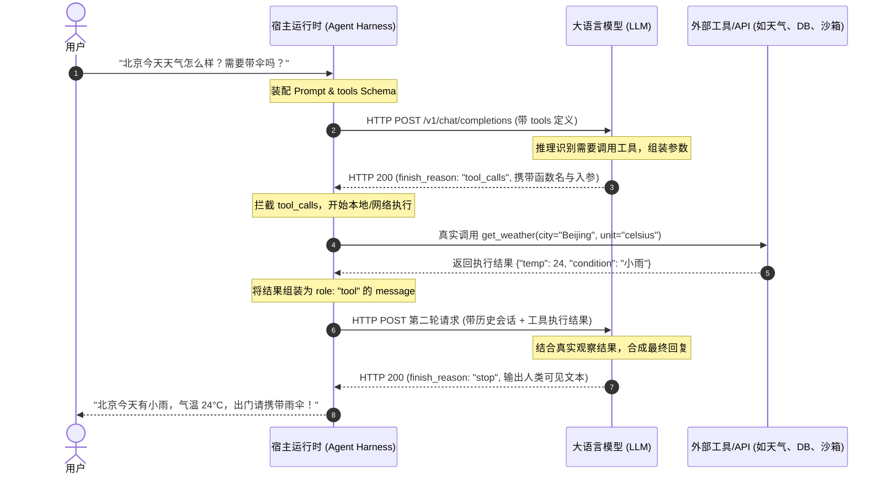

# 《AI Agent Book》读书与学习笔记

> **开源项目/电子书链接**: [bojieli/ai-agent-book](https://github.com/bojieli/ai-agent-book)

## 📌 内容简介

该开源电子书全面系统地介绍了 AI Agent 的基本概念、架构设计、工具调用、记忆机制与多智能体协作范式。

## 💡 核心读书笔记与感悟

**感知工具**让 Agent 能访问信息：搜索引擎提供实时网络数据，文件系统读取本地文档，API 和数据库则对接外部服务和企业核心数据。

**执行工具**让 Agent 改变世界：代码执行、文件操作、系统命令、外部 API 调用——决策由此变成实际行动。

**协作工具**让 Agent 与其他 Agent 分工合作：委托子 Agent 完成专项任务，在关键决策点请求人类确认，或在多 Agent 系统中协调行动。

**事件触发工具**与前三类在调用方式上有本质的区别——它们不是 Agent 主动调用的，而是作为外部输入来驱动 Agent 开始执行任务。比如收到一封新邮件、到了某个预定时间点、或另一个系统发出了 Webhook 回调，这些事件会激活 Agent，让它开始后续的思考和行动。虽然事件触发不是 Agent 主动调用的，但它是 Agent 与外部世界交互的通道之一，因此归入广义的工具体系。例如外部调度系统就是通过事件驱动监听，从而唤起 Agent 去执行任务。

---

## 🛠️ 底层机制：真实的 API 工具调用（Wire-Level Tool Calling）闭环

在 Agent 架构中，一个常见的误区是认为“大模型内部直接集成了各种工具代码并能直接调用网络或系统”。  
**实际上，LLM 本质上是无状态的文本概率生成模型，不直接执行任何现实代码。工具调用的本质是一套“LLM 决定意图与参数，外部宿主（Harness / Runtime）代为执行并回填观察结果”的状态机循环。**

### 1. 工具调用时序全景图




---

### 2. 线缆级别（Wire-Level）的 4 阶段真实 JSON 报文

以下以 OpenAI / OpenAI-compatible（如 DeepSeek, Qwen, GLM 等通用协议）标准接口为例，还原网络通信中流淌的真实 JSON 报文。

#### 阶段 1：客户端发起请求（注册与感知）

在 HTTP POST 的 Payload 根节点中，通过 `tools` 字段向模型注入遵循 **JSON Schema** 规范的工具元信息。

> 💡 **核心认知（候选能力清单 vs 自主决策）**：  
> 发起请求时，宿主程序（Harness）**预先并不知道**用户的问题究竟需要调用哪个工具。因此，Harness 在此阶段**装配的是当前系统所具备的“完整能力清单（候选工具菜单）”**，将选择权全盘交给 LLM。

```json
{
  "model": "gpt-4o",
  "messages": [
    {
      "role": "user",
      "content": "北京今天天气怎么样？需要带伞吗？"
    }
  ],
  "tools": [
    {
      "type": "function",
      "function": {
        "name": "get_weather",
        "description": "获取指定城市的实时天气数据和未来降雨预报",
        "parameters": {
          "type": "object",
          "properties": {
            "city": {
              "type": "string",
              "description": "城市名称，如 'Beijing' 或 'Shanghai'"
            },
            "unit": {
              "type": "string",
              "enum": ["celsius", "fahrenheit"],
              "description": "温度单位"
            }
          },
          "required": ["city"]
        }
      }
    },
    {
      "type": "function",
      "function": {
        "name": "search_web",
        "description": "通过搜索引擎查询最新的互联网资讯、网页内容或通用知识",
        "parameters": {
          "type": "object",
          "properties": {
            "query": {
              "type": "string",
              "description": "搜索关键词"
            }
          },
          "required": ["query"]
        }
      }
    },
    {
      "type": "function",
      "function": {
        "name": "calculator",
        "description": "进行高精度的数学算术运算或公式求解",
        "parameters": {
          "type": "object",
          "properties": {
            "expression": {
              "type": "string",
              "description": "待计算的数学表达式，例如 '12345 * 6789'"
            }
          },
          "required": ["expression"]
        }
      }
    }
  ],
  "tool_choice": "auto"
}
```

- `**tools` 数组（当前系统具备的能力清单）**：Harness 将当前环境可用的多个工具（如天气、搜索、计算器等）以标准 JSON Schema 形式一并呈递给模型。
- `**description`（语义匹配的核心基准）**：LLM 会将用户提问中的语义与各工具的 `description` 进行注意力比对。当识别到用户提问关于“天气与雨伞”时，模型会自动挑选 `get_weather`，并忽略与当前场景无关的 `search_web` 和 `calculator`。
- `**tool_choice: "auto"**`：允许模型自主决定是直接文字回答，还是从上述能力清单中挑出合适工具生成调用。若设为 `"required"` 则强制模型本轮必须至少调用清单中的某一个工具。

#### 阶段 2：LLM 决定调工具（返回 `tool_calls`）

LLM 计算后发现无法单凭训练权重回答实时天气，触发函数调用训练标记，**不输出普通正文**，而是输出结构化的调用指令：

```json
{
  "id": "chatcmpl-9xyz123",
  "object": "chat.completion",
  "choices": [
    {
      "index": 0,
      "message": {
        "role": "assistant",
        "content": null,
        "tool_calls": [
          {
            "id": "call_abc987654",
            "type": "function",
            "function": {
              "name": "get_weather",
              "arguments": "{\"city\": \"Beijing\", \"unit\": \"celsius\"}"
            }
          }
        ]
      },
      "finish_reason": "tool_calls"
    }
  ]
}
```

- `**content: null**`：LLM 此时并未生成面向最终用户的自然语言回复。
- `**tool_calls**`：模型提取出的调用意图，包括唯一的调用 ID（`call_abc987654`）、目标函数名及已完成实参绑定的 JSON 字符串（`arguments`）。
- `**finish_reason: "tool_calls"**`：通知宿主环境“思考尚未结束，请执行上述工具后回填结果”。

#### 阶段 3：宿主执行并回填观察结果（发起第二轮请求）

宿主（Agent Runtime）调用真实天气 API 拿到结果后，将“用户原问题 + LLM 工具调用意图 + 真实工具执行结果”**按序追加**至 `messages` 列表中，再次发起请求：

```json
{
  "model": "gpt-4o",
  "messages": [
    {
      "role": "user",
      "content": "北京今天天气怎么样？需要带伞吗？"
    },
    {
      "role": "assistant",
      "content": null,
      "tool_calls": [
        {
          "id": "call_abc987654",
          "type": "function",
          "function": {
            "name": "get_weather",
            "arguments": "{\"city\": \"Beijing\", \"unit\": \"celsius\"}"
          }
        }
      ]
    },
    {
      "role": "tool",
      "tool_call_id": "call_abc987654",
      "content": "{\"temp\": 24, \"condition\": \"小雨转中雨\", \"humidity\": \"85%\"}"
    }
  ]
}
```

- `**role: "tool"**`：专用的消息角色，代表外部环境返回的观察结果（Observation）。
- `**tool_call_id: "call_abc987654"**`：精确对齐阶段 2 中的调用请求，支持在多工具并发调用时精确匹配返回值。

#### 阶段 4：LLM 综合理解并输出最终答复

LLM 获得完整的上下文与客观事实后，整合信息生成面向用户的最终自然语言答案：

```json
{
  "choices": [
    {
      "message": {
        "role": "assistant",
        "content": "北京今天有小雨转中雨，气温约为 24°C，空气湿度较高。出门请务必随身携带雨伞！"
      },
      "finish_reason": "stop"
    }
  ]
}
```

- `**finish_reason: "stop"**`：模型完成所有推理与回答，对话闭环结束。

---

### 3. 关键架构要点与工程经验

1. **参数为何是字符串而非 JSON 对象**：
  在阶段 2 中，`function.arguments` 是一个未转义的 JSON 字符串。这是因为 LLM 自回归生成 Token 时是逐字吐出的文本流，由客户端反序列化库统一做 `json.loads` 解析。
2. **多工具并发调用（Parallel Tool Calling）**：
  现代前沿模型（GPT-4o、Claude 3.5/3.7、DeepSeek 等）支持单轮返回多个 `tool_calls`（例如同时调用获取北京天气与上海天气）。宿主可并发执行多个真实 API，再依次填回多个 `role: "tool"` 消息。
3. **架构解耦意义**：
  这一协议标准使得 LLM 彻底与操作系统、底层网络解耦。这也正是 [[harness_definition|Harness]] 理念的核心：**Model 只负责认知与决断，Harness 负责物理执行与背压验证**。

---

### 4. 进阶工程演进：如果系统有 100+ 个工具，难道全塞进 tools 的**JSON Schema**吗？

在实际企业级系统、操作系统级 Agent 或接入海量 MCP（Model Context Protocol）的场景中，工具数量动辄几十甚至上百个。若在阶段 1 将全部工具的 JSON Schema 一股脑打包进 `tools`，会导致两个致命瓶颈：

1. **上下文爆炸与高昂延迟（Context Bloat & Latency）**：百余个工具的定义会吃掉数万 Token，不仅单次调用成本激增，首字延迟（TTFT）也会大幅上升。
2. **工具混淆与准确率暴跌（Tool Confusion / Degradation）**：当候选选项过多时，LLM 注意力容易分散，出现选错工具、参数幻觉或相互干扰。

工业界落地时，通常演进出以下三种工程解决方案：

#### 方案 A：Tool RAG（工具向量检索与动态修剪）

- **机制**：
  1. 将全部工具的名称及其 `description` 提前计算 Embedding 并存入向量数据库（Vector DB）。
  2. 用户输入问题后，Harness 首先对提问进行向量检索（Top-K Search），快速筛选出语义最匹配的 **3~5 个候选工具**。
  3. 最终仅将这几个筛选后的工具装配进当前轮次的 `tools` 字段传给 LLM。
- **适用场景**：平铺型海量单功能 API（如成百上千个微服务查询接口）。

#### 方案 B：意图路由与分层 Agent（Router & Hierarchical Sub-Agents）

- **机制**：
  1. **第一层 Router Agent**：仅负责分类识别用户的宏观意图（如“运维排障”、“财务报销”、“日常助手”），自身不挂载庞大的具体执行工具。
  2. **第二层 Specialized Sub-Agent**：由 Router 将任务分发给专门的子智能体。每个子智能体仅携带本垂直领域内的专用工具集。
- **适用场景**：业务系统庞大、边界清晰的复杂 Agent 平台（符合 [[harness_definition|HumanLayer 的 Sub-Agents 上下文隔离防火墙]] 原则）。

#### 方案 C：两阶段元发现（Dynamic Tool Discovery / Two-Stage Tool Use）

- **机制**：
  1. 初始阶段不向 LLM 暴露具体工具，仅暴露 1~2 个元工具（Meta-tools），例如 `search_available_tools(query: string)`。
  2. LLM 意识到自己缺少工具时，先调用 `search_available_tools` 寻找具备特定能力的工具。
  3. Harness 执行后将匹配到的工具 Schema 动态注入到下一轮上下文中，供 LLM 后续调用。
- **适用场景**：动态插件生态、MCP 协议集成等插件数量不可预知的开放平台。

---

## 🔗 体系联动

- [[harness_definition|Harness 的精确定义与组件清单（含背压与循环机制）]]
- [[mcp_architecture_and_protocol|MCP 架构定位、底层通信与工程落地深度解析]]
- [[coding_agent_architecture|Coding Agent 核心架构与主流厂商方案对比]]

