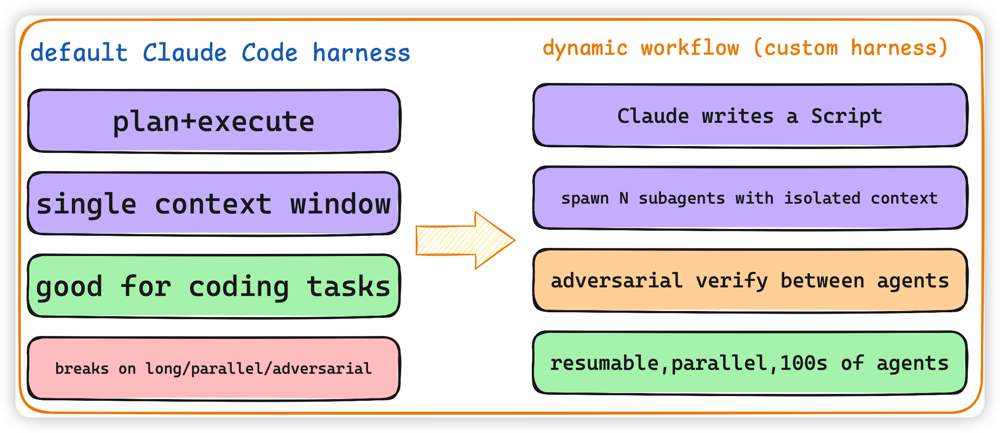
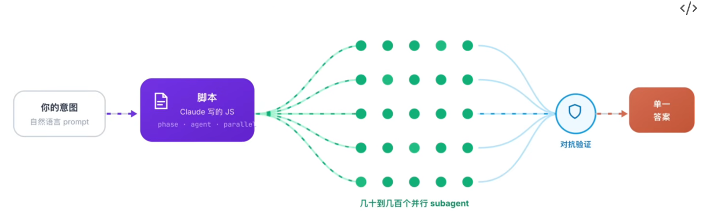
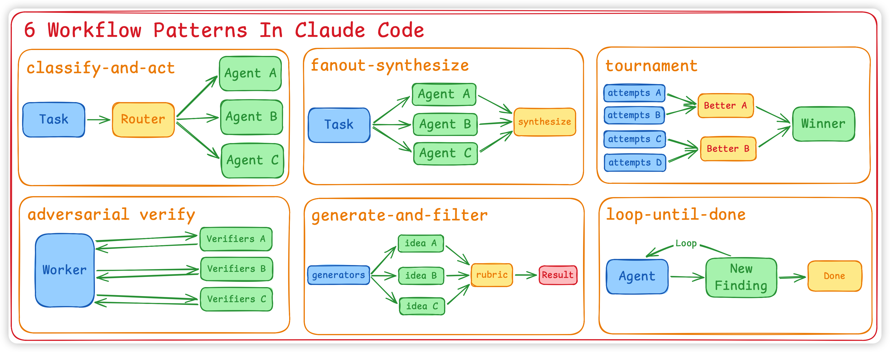
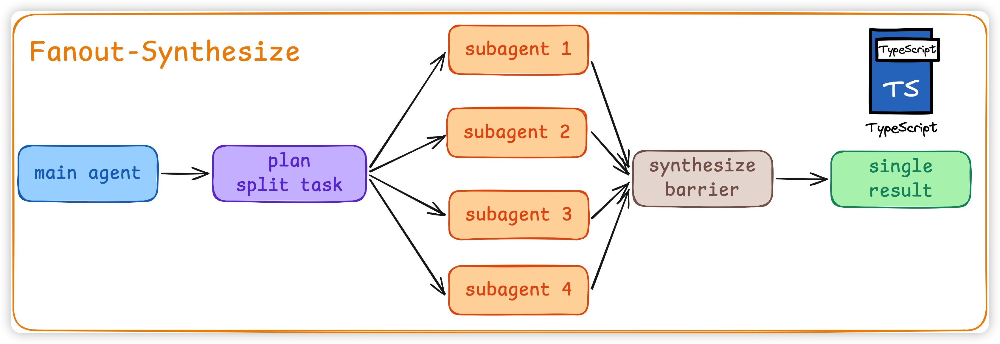
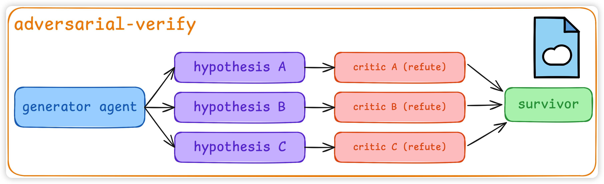

https://www.anthropic.com/engineering/harness-design-long-running-apps
https://claude.com/blog/a-harness-for-every-task-dynamic-workflows-in-claude-code

## Harness是什么
粗略算式
Harness = Agentic - Model
在 AI Agent 领域，Harness 是包裹在基础大模型（Foundation Model）外的那一层 [该干啥、怎么干、谁先谁后]的调度逻辑
**当一个Agent单Loop干不完一件事情的时候，--- 让Agent自己写一个一次性、为这个任务量身定做的harness.**  Cluade Code 默认的plan-execute loop 是harness; Cursor 的 Apply 流程也是 harness。

## 为什么构建Harness

构建Harness的目标，是为了解决大模型在 复杂/长时间任务中存在的痛点：

Agentic Laziness：面对包含几十个步骤的复杂任务，模型在完成其中一部分后，会倾向于宣布“我已经全部完成了"

Self-preferential Bias（自评偏差）：让 Claude 自己 judge 自己的输出，它倾向于认为自己是对的。这是单 context 的结构性缺陷。

Goal Drift (目标漂移)： 多轮交互与 Compaction（上下文压缩）后，长上下文遗忘导致 Agent 偏离最初的需求。那些「不要做 XX」的负向约束最容易丢。

### Anthropic的 Harness 架构
“三智能体架构” Planner + Generator + Evaluator

## 什么是Dynamic workflow
https://agent.csdn.net/6a388c9f662f9a54cb82826b.html
dynamic workflow，就是让Claude 自己写harness、自己调度几十上百个subagent的那套机制。

%% adversarial 对抗性的 %%
%% spawn N subagents with isolated context 生成 N 个具有隔离上下文的子智能体%%
coordinate 协调，dynamic workflow不仅要生成N个隔离的context的subagents，这些subagents还要互相协调

Dynamic workflow是Claude 看到你的任务以后，自己当场写一个 **JavaScript 编排脚本**，脚本里调用subagent的函数，决定开几个subagent, 怎么开，用什么模型，以及subagent之间互相交叉验证，自我纠错。这个脚本是 **用过即弃** 的
Anthropic 官方定义：

> A dynamic workflow is a JavaScript script that orchestrates subagents at scale. Claude writes the script for the task you describe, and a runtime executes it in the background while your session stays responsive.

以下是Dynamic workflow的示例图：
那么这个示例图是怎么来的呢？
Cluade 写harness有6种pattern. 当给Claude 下派任务的时候，Claude 会根据任务 **自由组合**，撰写出合适的JS脚本。上述 Dynamic workflow 里有 Classify-and-act, 之后接了一个fan-out-synthesize, 然后是一个adversarial verify 对抗性验证。

%% Cluade自己本身的context中只知道任务，和最终答案。 %%

## Cluade 写harness有6种pattern

### classify - and - act
最常见的**classify - and - act**: 专人 做专事。
接收用户输入的task 后，判断任务的类型 （例如：是bug修复，功能开发，还是代码审计等），然后将判断结果 router 路由给最合适的subagents.
### fan - out - synthesize

这是一种非常常见的并行处理模式，其核心流程如下：

- **拆分 (Fan-out)：** 将一个大任务拆分为许多较小的步骤或子任务，并为每个步骤运行一个独立的子智能体。
- **独立上下文：** 每个子代理都在自己干净的上下文窗口中运行，避免信息交叉污染。
- **屏障综合 (Synthesize barrier)：** 这是一道“屏障”，它会等待所有扇出的智能体完成工作，然后将它们的结构化输出合并为一个最终结果。 此模式特别适用于处理 **500 个文件迁移** 或大规模代码审计等任务。

### adversarial - verify

这个 pattern 的目的是解决单一agentic 容易产生的self-preferential bias, 即 agentic总是倾向于认为自己的答案是对的。我们不能跟模型说「你要批判自己的答案」，它做不到。但你可以开一个**新的 context、不带历史、专门挑刺**的 agent去做这件事情。

1. 每一个 subagent 的产出，都开一个**全新的 critic agent** 去攻击它。
2. critic 看不到 generator 的 reasoning trace，它只看结果，根据预设的评分准则 (rubric) 挑刺。挑得过关的才往下走。

## dynamic workflow中不同subagent使用哪种模型？

对于一个长时间且复杂的任务，dynamic workflow 通常会通过 classify - and - act 进行研究，可以**让 classifier agent 自己决定——简单子任务给 Sonnet 或haiku、复杂的给 Opus**。workflow 脚本中可以指定subagent用哪个模型。如果没有触发这种路由逻辑，子智能体将默认使用你当前会话的模型.

dynamic的本质是 Claude 实时编写的一次性 JavaScript 脚本，因此这种“切换模型”的行为是直接**写在执行逻辑中**的。脚本可以显式指定某个 `agent()` 函数调用时使用的模型参数

## 可以设置token budget
e.g. use 10k tokens...<用户写的具体task>

