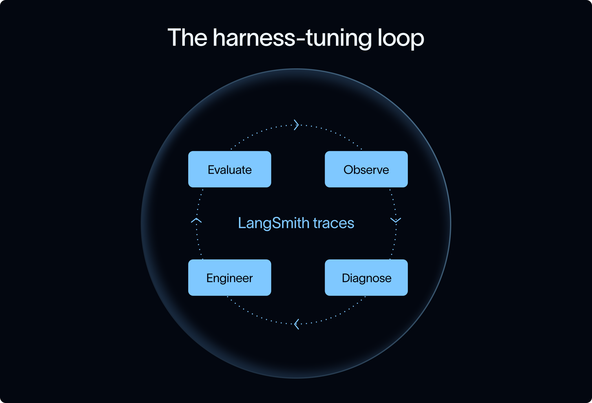

# LangChain & NVIDIA NemoClaw Deep Agents Blueprint 深度研读

> **相关参考**:
> - [LangChain Blog: LangChain and NVIDIA launch the NemoClaw Deep Agents Blueprint](https://www.langchain.com/blog/langchain-and-nvidia-launch-the-nemoclaw-deep-agents-blueprint)
> - [NVIDIA Build: NemoClaw for LangChain Deep Agents Code](https://build.nvidia.com/nvidia/nemoclaw-for-langchain-deep-agents-code/nemoclawcard)
> - [GitHub: langchain-ai/deepagents](https://github.com/langchain-ai/deepagents)

---

## 🏗️ 架构蓝图 (Architecture Blueprint)

---

## 🔄 Harness 调优循环 (Harness Tuning Loop)

---

## 💡 核心思考与实战猜想

1. **针对性调优 (Harness Tuning)**：  
   针对 NVIDIA Nemotron 3 Ultra 等模型进行 Harness Tuning（定制 System Prompts、严格 Back-pressure 校验、结构化 Hand-off），能否在特定工程场景下让开源/专用模型达到媲美 Claude 3.5 Sonnet / Opus 4.8 的任务完成率？

2. **跨模型迁移可行性**：  
   使用这套 LangChain Deep Agents Harness，如果将底层的 Nemotron 3 Ultra 替换为国产优秀开源模型（如 GLM-4 / GLM-5 系列、DeepSeek 系列），其性能与稳定性表现如何？需要调整哪些沙箱约束与验证回路？
