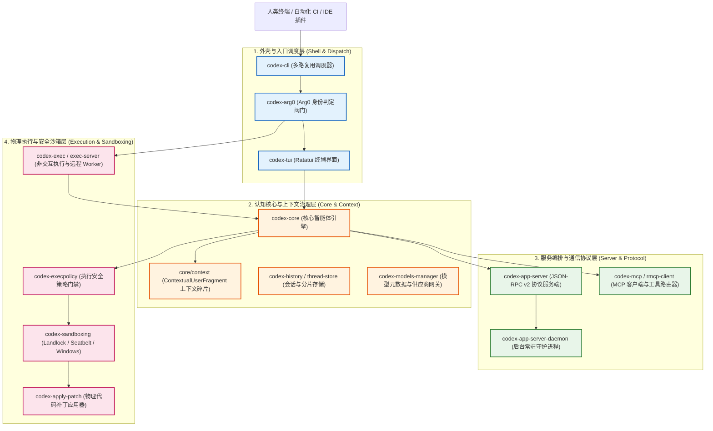

# OpenAI Codex 全景架构：基于 codex-rs 的工业级 Harness 解析

> **核心公理**: $$\text{Harness} = \text{Agent} - \text{Model}$$
> 本文旨在系统性解构 OpenAI 官方开源代码库 **`codex-rs`** 的全景软件架构。通过剥离语言表象，透视其作为顶尖工业级 Coding Agent 的分层架构、核心子系统分工及安全隔离生命周期。

---

## 🗺️ 1. 整机架构分层全景

OpenAI Codex 采用清晰的四层解耦架构，从最外层的人机交互分发，到最底层的内核沙箱隔离，形成了严密的执行外壳：



---

## 🧱 2. 核心 Crate 职责矩阵

在 `codex-rs/` 工作区中，各核心模块严格遵循“高内聚、低耦合、严控膨胀”的原则：

| 架构层级 | Crate 名称 | 核心职责 | 关联深入笔记 |
| :--- | :--- | :--- | :--- |
| **外壳调度** | `codex-cli`<br/>`codex-arg0` | 统一命令行参数解析、全局配置注入、进程身份识别（“普通运行” vs “影子辅助运行”）。 | [[openai_codex_cli\|CLI 瘦外壳与双重运行形态]] |
| **用户界面** | `codex-tui` | 基于 Ratatui 构建的高性能异步终端 UI；支持流式 Markdown、语法高亮与按键中断。 | *[待探索]* |
| **智能体中枢** | `codex-core` | 负责完整的 Agent Loop：Prompt 装配、模型调用、工具选择。严格执行上下文治理（单项不超过 10K Tokens、禁止历史重写）。 | *[待探索]* |
| **协议服务端** | `codex-app-server` | 暴露标准 JSON-RPC v2 API，负责将 Agent 会话能力解耦暴露给 IDE 插件（如 VS Code/Cursor）或云端远程控制。 | *[待探索]* |
| **安全沙箱** | `codex-sandboxing` | 跨平台操作系统级防爆屏障：macOS（Seatbelt）、Linux（Landlock + Namespaces）、Windows（受限令牌与作业对象）。 | *[待探索]* |
| **执行引擎** | `codex-exec`<br/>`codex-exec-server` | 驱动单次任务批处理、Code Review 自动化门禁，以及作为分布式 Worker 节点运行。 | *[待探索]* |

---

## 🔄 3. 单次执行周期的端到端数据流

当用户在终端输入一条需求（例如“修改当前项目的单元测试并运行验证”）时，整个 Harness 系统内部的协同流转如下：

```text
[1. 人机输入] ──► CLI 识别为普通运行 ──► 拉起 Tokio 运行时与 TUI
                       │
[2. 上下文组装] ──► 核心引擎 (codex-core) 从项目抓取 ContextualUserFragment、配置与历史
                       │
[3. 模型推理] ──► 流式连接 OpenAI API，返回文本思考与 `tool_calls`（例如要求运行 `cargo test`）
                       │
[4. 策略门禁] ──► 拦截器触发 `codex-execpolicy` 校验指令风险等级
                       │
[5. 沙箱重入] ──► 主进程以 Arg0 Trick 派生“影子子进程”，进入 `codex-sandboxing` 物理受限区
                       │
[6. 背压验证] ──► 捕获沙箱内测试报错/输出 ──► 作为观察结果（Observation）回填上下文
                       │
[7. 自愈/终止] ──► 驱动模型根据测试失败信息进行代码修正，或完成任务安全退出
```

---

## 🔬 4. Codex 架构对 Harness Engineering 的核心启示

1. **外壳与大脑彻底分离**：
   符合公理 $\text{Harness} = \text{Agent} - \text{Model}$。大模型没有任何系统特权，它的一切读写要求都必须作为“意图报文”提交给外部 Harness，由 Harness 完成审计、沙箱包装后代为执行。
2. **单二进制交付下的进程隔离（Arg0 Trick）**：
   无需向用户分发多个混乱的可执行文件，利用操作系统底层的 `argv[0]` 判定阀门，同时优雅满足“单文件分发”与“子进程物理沙箱”的两难抉择。
3. **严格的上下文与缓存控制**：
   在 `AGENTS.md` 的规范中明确强调：**禁止重写历史、严格控制单项上下文尺寸（上限 10K tokens）、单项跨越 1K tokens 需升格审查**。这是工业级智能体防止“上下文腐化（Context Rot）”与优化 API Prompt Cache 命中率的关键准则。

---

## 📑 5. 深入分篇导航

Codex 的架构庞大而精密，后续将按子系统逐步展开深入逆向：
- 🟢 **第一篇·入口与外壳**：[[openai_codex_cli|OpenAI Codex CLI 逆向：瘦外壳与双重运行形态]] *(已深入消化)*
- ⚪ **第二篇·核心循环与上下文**：`openai_codex_core.md` *(待后续学习探索)*
- ⚪ **第三篇·跨平台沙箱隔离**：`openai_codex_sandboxing.md` *(待后续学习探索)*
- ⚪ **第四篇·协议服务端与 RPC**：`openai_codex_app_server.md` *(待后续学习探索)*

---

## 🔗 体系联动

- [[openai_codex_cli|OpenAI Codex CLI 逆向：瘦外壳与双重运行形态]]
- [[coding_agent_architecture|Coding Agent 核心架构与主流厂商方案对比]]
- [[harness_definition|Harness 的精确定义与组件清单（含背压机制）]]
- [[harness_lifecycle|Harness 生命周期与 Model/Project 关系辨析]]
- [[mcp_architecture_and_protocol|MCP 架构定位、底层通信与工程落地深度解析]]
