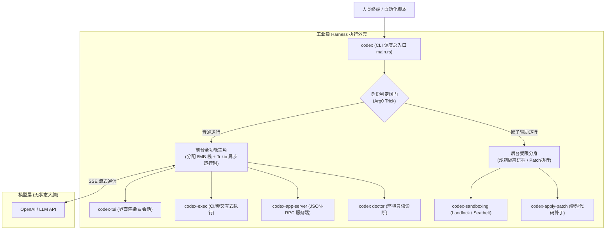

# OpenAI Codex CLI 逆向：瘦外壳与双重运行形态

> **核心公理**: $$\text{Harness} = \text{Agent} - \text{Model}$$
> 本文是 [[openai_codex_architecture|OpenAI Codex 全景架构]] 的第一篇专项深潜。基于对 OpenAI Codex 官方开源核心实现（`codex-rs/cli`）的代码逆向，深入剖析其 CLI 顶层执行外壳（Thin Harness Shell）的设计智慧：**如何通过“双重身份（普通运行 vs 影子辅助运行）”兼顾单文件交付与物理沙箱隔离，以及其底层的安全设防、Tokio 异步运行时与容灾自愈回路**。

---

## 🏛️ 1. 架构定位：瘦执行外壳（Thin Harness Shell）

在 Codex 的整机系统设计中，`codex-rs/cli` 扮演的是**顶层多路复用调度器（Multi-call Binary Dispatcher）**的角色：



### 核心设计原则
1. **不沉淀重型业务**：CLI 自身不包含复杂的大模型 Prompt 编排、TUI 像素级绘制或沙箱底层系统调用，所有重型逻辑全部下沉到下层独立 crate。
2. **极小化特权与环境自省**：统一接管全局配置覆盖（`-c key=value`）、特性开关（Feature Toggles）、环境变量净化与终端能力检测（Dumb 降级拦截）。

---

## 🎭 2. 核心机制：普通运行 vs. 影子辅助运行（Arg0 Trick）

这是工业级 Coding Agent 在操作系统层面上最具智慧的工程折中。

### 核心矛盾
- **用户体验诉求**：产品要求**“单文件极简分发”**，用户下载或安装时只想得到一个干净的 `codex` 二进制程序，不希望系统里多出一堆碎头碎片的小辅助进程。
- **系统安全诉求**：当大模型要执行一段未知的 Shell 脚本（如 `npm test`）时，**主进程绝不能亲自执行，也不能把自己关进沙箱**（否则主进程自身的 TUI 界面渲染、网络通信全被切断）。必须起一个物理隔离的独立子进程进沙箱执行。

### 破局之道：多路复用二进制分流（BusyBox 模式）

Codex 在 `codex-rs/arg0/src/lib.rs` 中通过判断 `argv[0]` 和 `argv[1]`（进程启动时的名称与第一参数）来识别当前进程的真实使命：

| 维度 | 普通运行（`_or_else` 主干分支） | 影子辅助运行（`arg0` 内部接管分支） |
| :--- | :--- | :--- |
| **是谁唤起的？** | **人类用户**（或 CI 脚本）在终端显式执行 `codex` | **Codex 主进程自身**在后台 `Command::spawn` 重新唤起自身 |
| **进程名称 (`argv[0]`)** | `codex` 或 `/usr/local/bin/codex` | 临时别名或软链接：`codex-linux-sandbox`、`apply_patch`、`codex-execve-wrapper` |
| **核心职责** | 作为 Agent 主角：加载配置、调用大模型、监听用户键盘、渲染全屏 TUI 界面 | 作为底层工具人：潜入 Linux Landlock/Namespaces 运行命令、执行打补丁算法，做完立刻退出 |
| **运行时环境** | 分配 8MB 栈空间独立线程，拉起 **Tokio 异步多线程引擎** | 极简同步执行或专属轻量运行时，绝不加载任何 UI 与模型通信逻辑 |

---

## 🛡️ 3. 进程启动三部曲：`fn main()` 的安全与环境设防

在 `cli/src/main.rs` 中，启动流程体现了极高的防御性工程水准：

```rust
fn main() -> anyhow::Result<()> {
    codex_build_info::initialize!();
    let remote_control_disabled = codex_app_server::take_remote_control_disabled_env();
    arg0_dispatch_or_else(move |arg0_paths: Arg0DispatchPaths| async move {
        Box::pin(cli_main(arg0_paths, remote_control_disabled)).await?;
        Ok(())
    })
}
```

### 1. 记录出身证明 (`codex_build_info::initialize!()`)
- **实现位置**：`codex-rs/build-info/src/lib.rs`
- **设计考量**：采用宏展开（`macro_rules!`）在最外层的 `main.rs` 编译点读取 `STABLE_GIT_COMMIT` 环境变量。这样代码库的每次 Git Commit 只需重新链接最终可执行文件，**避免了底层公共库发生级联失效重编（Cache Invalidation）**。

### 2. 擦除敏感环境变量 (`codex_app_server::take_remote_control_disabled_env()`)
- **实现位置**：`codex-rs/app-server-transport/src/transport/remote_control/mod.rs`
- **设计考量**：在多线程尚未启动的同步阶段，原子读取内部控制变量（如是否禁用远程遥控）并调用 `remove_var` **立即物理擦除**。防止后续生成的子进程、第三方插件或不受信代码通过环境变量继承意外读取到敏感标记。

### 3. 身份分流与运行时装载 (`arg0_dispatch_or_else`)
- **实现位置**：`codex-rs/arg0/src/lib.rs`
- **执行逻辑**：
  1. 调用 `arg0_dispatch()` 嗅探当前进程是否是沙箱分身；如果是，直接移交底层控制权并终止退出。
  2. 如果判定为人类发起的“普通运行”，为避免复杂 Agent 异步状态机引发默认系统栈溢出，在独立的专用线程（8MB 栈预算）中创建 **Tokio 多线程异步运行时**。
  3. 将当前进程物理路径与沙箱路径封装为 `Arg0DispatchPaths`，正式交付给 `cli_main`。

---

## ⚡ 4. 为什么 Codex 必须依托 Tokio 异步运行时？

Rust 标准库只提供语言级的 `async/await` 语法和 `Future` 抽象，故意不包含底层事件循环和调度器。Tokio 充当了 Codex 的**底层异步操作调度中枢**：

1. **三路并发驱动**：
   - **流式通信**：通过 HTTP/SSE 逐字接收大模型输出的 Token 流；
   - **响应式 UI**：实时捕获人类终端按键（Ctrl-C 中断、翻页），以 60 FPS 刷新 TUI；
   - **受限子进程**：后台非阻塞监听沙箱中运行的编译与测试指令输出。
2. **极低资源开销**：避免为每项 I/O 任务开辟重型操作系统原生线程，以少数几个工作线程（Work-stealing Threads）轻松支撑复杂的并发状态流转。

---

## 🧰 5. `codex-cli` 工具矩阵与工程兜底机制

除 `main.rs` 外，`cli/src/` 中的子模块完整映射了现代化 Coding Agent 的基础设施需求：

| 模块类别 | 代表源码文件 | 核心工程职责与设计细节 |
| :--- | :--- | :--- |
| **沙箱与安全隔离** | `debug_sandbox.rs`<br/>`wsl_paths.rs` | 统一抽象平台差异：macOS 调用 Seatbelt、Linux 调用 Landlock + Seccomp、Windows 采用受限令牌。在 WSL 下实现 Win/Linux 路径（`C:\` ↔ `/mnt/c/`）的双向安全映射。 |
| **容灾自愈回路** | `state_db_recovery.rs` | **黑天鹅兜底**：当用户断电或崩溃导致本地 SQLite 状态数据库损坏时，Harness 不 Panic，而是自动检测物理损坏，将坏库安全移入 `backup` 目录，以崭新数据库重新冷启，最大化可用性。 |
| **无侵入健康体检** | `doctor.rs` (及子目录) | 提供 `codex doctor` 命令。遵循**只读、不修改用户系统、输出完全脱敏**的原则，探测网络代理、TLS 证书、Git 权限、沙箱内核支持，并生成诊断报告。 |
| **工具生态挂载** | `mcp_cmd.rs`<br/>`plugin_cmd.rs` | 管理外部 Model Context Protocol (MCP) 服务器与 Marketplace 插件。在 `mcp_login.rs` 中特别支持了无浏览器环境下的“粘贴回调模式（PasteCallback）”，保证无头环境依然可鉴权。 |
| **非侵入队列追加** | `queue_cmd.rs` | 允许外部脚本或辅助终端通过 `codex queue` 向正在运行的前台会话安全追加新指令，无需打断全屏 TUI 渲染。 |

---

## 🔗 体系联动

- [[openai_codex_architecture|OpenAI Codex 全景架构：基于 codex-rs 的工业级 Harness 解析]]
- [[harness_definition|Harness 的精确定义与组件清单（含背压机制）]]
- [[harness_lifecycle|Harness 生命周期与 Model/Project 关系辨析]]
- [[coding_agent_architecture|Coding Agent 核心架构与主流厂商方案对比]]
- [[mcp_architecture_and_protocol|MCP 架构定位、底层通信与工程落地深度解析]]
