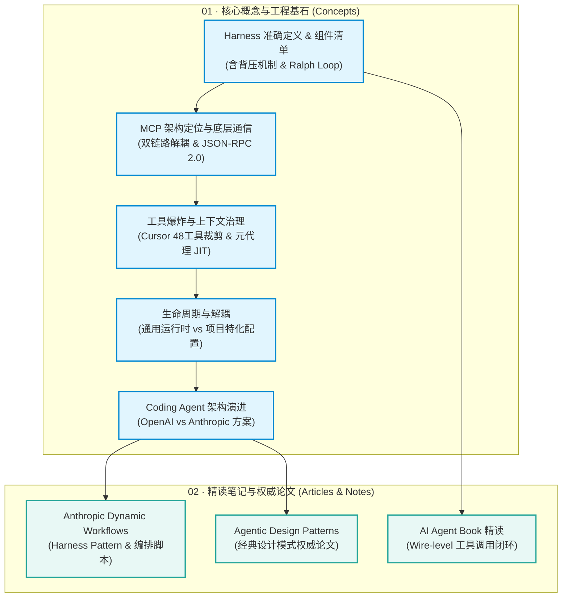

# LLM Agent & Harness Engineering 知识库

> **核心工程心智模型**:  
> $$\text{Harness} = \text{Agent} - \text{Model}$$  
> **Model**（大模型）是无状态的大脑；**Harness** 是包裹在模型之外的“操作系统”与“执行外壳”——负责上下文管理、工具调度、子智能体编排与背压验证循环。

---

## 🗺️ 架构全景与学习脉络



---

## 📑 知识库地图 (Map of Content / MOC)

### 🧠 01. 核心概念与工程范式 (`01_concepts/`)
> 夯实 Harness Engineering 的理论基础，厘清模型、外壳、项目与背压验证的边界。所有内容均已深入消化并形成自洽心智模型。

| 文档 | 核心要点 / Takeaway | 关联概念 |
| :--- | :--- | :--- |
| [Harness 精确定义与组件清单](./01_concepts/harness_definition.md) | LangChain 架构分解、HumanLayer 六个杠杆（≤60行AGENTS.md、背压、子代理等）、背压哲学（优化迭代速度而非首次成功率）、Ralph Loop 拦截退出与重启 | `Handoff`, `Back-Pressure`, `Ralph Loop`, `MCP` |
| [MCP 架构定位、底层通信与工程落地](./01_concepts/mcp_architecture_and_protocol.md) | LLM 不跑 MCP；Host (e.g. Cursor) 与 LLM（HTTP POST tools）及 Host (e.g. Cursor) 与 MCP Server（JSON-RPC 2.0）双链路解耦；三大支柱与防爆仓工程实践 | `MCP`, `JSON-RPC 2.0`, `Context Firewall` |
| [工具爆炸与上下文治理：以 Cursor 工业实践为例](./01_concepts/tool_explosion_and_governance.md) | 源码剖析全局 48 个内置工具角色裁剪；V0~V2 架构演进；XML 目录索引 + 两阶段元工具代理（`GetDynamicTools`/`CallDynamicTool`）；大文本防爆舱落盘 | `Tool Explosion`, `Meta-Tool Proxy`, `JIT Schema` |
| [Harness 生命周期与解耦](./01_concepts/harness_lifecycle.md) | 模型与 Harness 的循环依赖困境；**通用运行时（Runtime）** 与 **项目特化配置（Project Config）** 的两层解耦架构 | `Runtime vs Config`, `Context Rot` |
| [Coding Agent 架构演进与方案对比](./01_concepts/coding_agent_architecture.md) | Coding Agent 从单轮补全到全自主闭环；OpenAI 去中心化 SDK 移交 vs Anthropic 物理工件流转 | `Sebastian Raschka`, `OpenAI`, `Anthropic` |

---

### 📚 02. 精读笔记与论文研读 (`02_articles_notes/`)
> 追踪前沿厂商生产实践与经典设计模式，拆解 Wire-Level 工具调用底层机制。

| 文档 | 核心要点 / Takeaway | 关键机制 |
| :--- | :--- | :--- |
| [Anthropic Dynamic Workflows 深度解析](./02_articles_notes/anthropic_dynamic_workflows.md) | 解决偷懒/自评偏差/目标漂移；Claude 动态生成用过即弃的 JS 编排脚本；**6 大 Harness Pattern**（分类分流、扇出汇总、对抗性验证等） | `Dynamic Workflows`, `Adversarial Verify`, `Fan-out` |
| [《AI Agent Book》精读笔记](./02_articles_notes/ai_agent_book.md) | 四大工具体系剖析；**Wire-level 真实 API 工具调用闭环**（Schema 注册、tool_calls 挂起、回填与 stop 终态） | `Tool Use`, `Wire-level API`, `Event Trigger` |
| `Agentic-Design-Patterns.pdf` | 吴恩达等学者的 Agentic 经典设计模式论文合集（Reflection, Tool Use, Planning, Multi-agent） | `Design Patterns`, `Reflection`, `Planning` |

---

## 📂 规范目录结构一览

```text
llm-agent-learning/
├── 01_concepts/                         # 🧠 核心概念与工程基石 (已彻底消化)
│   ├── harness_definition.md            # Harness 精确定义、组件清单、背压哲学与 Ralph Loop
│   ├── mcp_architecture_and_protocol.md # MCP 架构定位、底层通信与工程落地深度解析
│   ├── tool_explosion_and_governance.md # 工具爆炸与上下文治理：以 Cursor 工业实践为例
│   ├── harness_lifecycle.md             # Harness 生命周期与 Runtime / Config 解耦
│   └── coding_agent_architecture.md     # Coding Agent 架构演进与 OpenAI/Anthropic 方案对比
│
├── 02_articles_notes/                   # 📚 精读笔记与论文 (已深入消化)
│   ├── Agentic-Design-Patterns.pdf      # Agentic 设计模式权威论文
│   ├── ai_agent_book.md                 # 《AI Agent Book》精读：四大工具体系与 Wire-Level 工具调用闭环
│   └── anthropic_dynamic_workflows.md   # Anthropic Dynamic Workflows 与 6 大 Pattern 深度解析
│
├── assets/                              # 🖼️ 架构图与资源图库
│   ├── adversarial-verify.png
│   ├── claude_harness.png
│   ├── claude_harness_pattern.png
│   ├── dynamic_workflow_example.png
│   ├── evoludation_20260629_113940.png
│   ├── fan-out-synthesize.png
│   ├── Screenshot 2026-07-15 at 18.11.37.png
│   └── Screenshot 2026-07-16 at 07.05.03.png
│
├── README.md                            # 🗺️ 知识库全景导航 (MOC)
└── .gitignore                           # Git 忽略配置
```

---

## 💡 使用指南
- **Obsidian 丝滑联动**：所有笔记均原生支持 Obsidian 双向链接（如 `[[harness_definition]]`、`[[anthropic_dynamic_workflows]]`），支持图谱视图（Graph View）与反向链接（Backlinks）。
- **Markdown / GitHub 完美兼容**：文档内所有的表格、Mermaid 流程图、相对路径图片链接（`../assets/...`）均遵循标准 Markdown 规范，在 GitHub 与各类 Markdown 阅读器中均可直接渲染。
