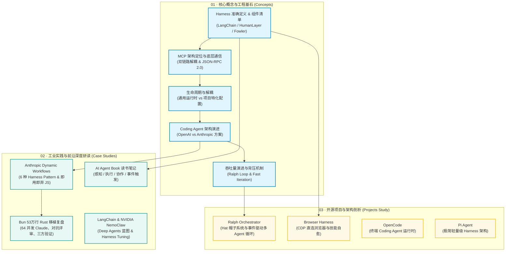

# LLM Agent & Harness Engineering 知识库

> **核心工程心智模型**:  
> $$\text{Harness} = \text{Agent} - \text{Model}$$  
> **Model**（大模型）是无状态的大脑；**Harness** 是包裹在模型之外的“操作系统”与“执行外壳”——负责上下文管理、工具调度、子智能体编排与背压验证循环。

---

## 🗺️ 架构全景与学习脉络



---

## 📑 知识库地图 (Map of Content / MOC)

### 🧠 01. 核心概念与工程范式 (`01_concepts/`)
> 夯实 Harness Engineering 的理论基础，厘清模型、外壳、项目与背压验证的边界。

| 文档 | 核心要点 / Takeaway | 关联概念 |
| :--- | :--- | :--- |
| [Harness 精确定义与组件清单](./01_concepts/harness_definition.md) | LangChain 架构分解、HumanLayer 六个杠杆（≤60行AGENTS.md、背压、子代理等）、Martin Fowler 三层框架 | `Handoff`, `Back-Pressure`, `MCP` |
| [MCP 架构定位、底层通信与工程落地](./01_concepts/mcp_architecture_and_protocol.md) | LLM 不跑 MCP；Host (e.g. Cursor) 与 LLM（HTTP POST tools）及 Host (e.g. Cursor) 与 MCP Server（JSON-RPC 2.0）双链路解耦；三大支柱与防爆仓工程实践 | `MCP`, `JSON-RPC 2.0`, `Context Firewall` |
| [Harness 生命周期与解耦](./01_concepts/harness_lifecycle.md) | 模型与 Harness 的循环依赖困境；**通用运行时（Runtime）** 与 **项目特化配置（Project Config）** 的两层解耦架构 | `Runtime vs Config`, `Context Rot` |
| [Coding Agent 架构演进与方案对比](./01_concepts/coding_agent_architecture.md) | Coding Agent 从单轮补全到全自主闭环；OpenAI 去中心化 SDK 移交 vs Anthropic 物理工件流转 | `Sebastian Raschka`, `OpenAI`, `Anthropic` |
| [吞吐量演进、Ralph 循环与背压机制](./01_concepts/throughput_and_backpressure.md) | 优化迭代速度而非首次成功率；Ralph Loop 拦截退出与重注入上下文；没有测试/Lint 背压的迭代就是“快速腐烂” | `Ralph Loop`, `Back-Pressure`, `HumanLayer` |

---

### 📚 02. 工业级实践与前沿深度复盘 (`02_articles_notes/`)
> 追踪前沿厂商生产实践与顶级开源团队的真实工程复盘。

| 文档 | 核心要点 / Takeaway | 关键机制 |
| :--- | :--- | :--- |
| [Anthropic Dynamic Workflows 深度解析](./02_articles_notes/anthropic_dynamic_workflows.md) | 解决懒惰/自评偏差/目标漂移；Claude 自行编写用过即弃的 JS 脚本；**6 大 Pattern**（分类分流、扇出汇总、对抗性验证等） | `Dynamic Workflows`, `Adversarial Verify`, `Fan-out` |
| [Bun 53万行 Rust 机械移植复盘](./02_articles_notes/bun_rust_porting_case.md) | 50 个 Dynamic Workflows、峰值 64 并发 Claude、11 天 6778 次提交；1 实现者 + 2 对抗评审者；修流程而非手改代码 | `Tournament Pattern`, `Code Migration`, `CI Oracle` |
| [LangChain & NVIDIA NemoClaw 蓝图](./02_articles_notes/langchain_nemoclaw_blueprint.md) | Deep Agents 架构蓝图与 Harness 调优循环；针对开源模型（Nemotron / 国产大模型）通过外围 Harness 调优逼近顶尖模型效果 | `Harness Tuning Loop`, `Deep Agents` |
| [《AI Agent Book》精读笔记](./02_articles_notes/ai_agent_book.md) | 四大工具体系剖析；**Wire-level 真实 API 工具调用闭环**（Schema 注册、tool_calls 挂起、回填与 stop 终态） | `Tool Use`, `Wire-level API`, `Event Trigger` |
| `Agentic-Design-Patterns.pdf` | 吴恩达等学者的 Agentic 经典设计模式论文合集 | `Reflection`, `Tool Use`, `Planning`, `Multi-agent` |

---

### 🛠️ 03. 开源项目研读与源码剖析 (`03_projects_study/`)
> 剖析主流开源 Agent / Harness 框架的底层实现与核心设计模式。

| 项目笔记 | 仓库链接 | 核心设计亮点 |
| :--- | :--- | :--- |
| [Ralph Orchestrator 研读](./03_projects_study/ralph_orchestrator.md) | [mikeyobrien/ralph-orchestrator](https://github.com/mikeyobrien/ralph-orchestrator) | **Hat (帽子) 系统**：Planner → Builder → Critic → Finalizer；事件驱动监听与持续执行循环 |
| [Browser Harness 研读](./03_projects_study/browser_harness.md) | [browser-use/browser-harness](https://github.com/browser-use/browser-harness) | **CDP 管道直连**真实 Chrome；自愈型 Helper 代码与动态 Domain-skills 渐进沉淀 |
| [OpenCode 架构研读](./03_projects_study/opencode.md) | [anomalyco/opencode](https://github.com/anomalyco/opencode) | 终端 AI Coding Agent 架构，环境与执行上下文压缩探索 |
| [Pi Agent Harness 研读](./03_projects_study/pi_agent_harness.md) | [earendil-works/pi](https://github.com/earendil-works/pi) | 极简 Agent 运行时与 Harness 约束机制 |

---

## 📂 规范目录结构一览

```text
llm-agent-learning/
├── 01_concepts/                         # 🧠 核心概念与工程基石
│   ├── harness_definition.md            # Harness 精确定义与组件清单 (LangChain/HumanLayer/Fowler)
│   ├── mcp_architecture_and_protocol.md # MCP 架构定位、底层通信与工程落地深度解析
│   ├── harness_lifecycle.md             # Harness 生命周期与 Runtime / Config 解耦
│   ├── coding_agent_architecture.md     # Coding Agent 架构演进与 OpenAI/Anthropic 方案对比
│   └── throughput_and_backpressure.md   # 吞吐量演进、Ralph 循环与背压机制
│
├── 02_articles_notes/                   # 📚 工业实践与前沿深度精读
│   ├── Agentic-Design-Patterns.pdf      # Agentic 设计模式权威论文
│   ├── ai_agent_book.md                 # 《AI Agent Book》精读：四大工具体系与 Wire-Level 工具调用闭环
│   ├── anthropic_dynamic_workflows.md   # Anthropic Dynamic Workflows 与 6 大 Pattern 深度解析
│   ├── bun_rust_porting_case.md         # Bun 53万行 Rust 移植实战复盘 (64并发 Claude)
│   └── langchain_nemoclaw_blueprint.md  # LangChain & NVIDIA NemoClaw 架构蓝图与调优循环
│
├── 03_projects_study/                   # 🛠️ 开源项目与架构剖析
│   ├── browser_harness.md               # Browser Harness：CDP 直连与技能自愈
│   ├── opencode.md                      # OpenCode：终端 Coding Agent 架构
│   ├── pi_agent_harness.md              # Pi Agent：轻量级 Agent 运行时探索
│   └── ralph_orchestrator.md            # Ralph Orchestrator：帽子系统与事件驱动编排
│
├── assets/                              # 🖼️ 架构图与资源图库
│   ├── adversarial-verify.png
│   ├── claude_harness.png
│   ├── claude_harness_pattern.png
│   ├── dynamic_workflow_example.png
│   ├── evoludation_20260629_113940.png
│   ├── fan-out-synthesize.png
│   ├── harness-tuning_loop.png
│   ├── nemoClaw blueprint for langchain.png
│   ├── Screenshot 2026-07-15 at 18.11.37.png
│   └── Screenshot 2026-07-16 at 07.05.03.png
│
├── README.md                            # 🗺️ 知识库全景导航 (MOC)
└── .gitignore                           # Git 忽略配置
```

---

## 💡 使用指南
- **Obsidian 丝滑联动**：所有笔记均原生支持 Obsidian 双向链接（如 `[[harness_definition]]`、`[[anthropic_dynamic_workflows]]`），支持图谱视图（Graph View）与反向链接（Backlinks）。
- **Markdown / GitHub 完美兼容**：文档内所有的表格、Mermaid 流程图、相对路径图片链接（`../assets/...`）均遵循标准 Markdown 规范，在 GitHub 与各类 Markdown 阅读器中均可直接渲染。
